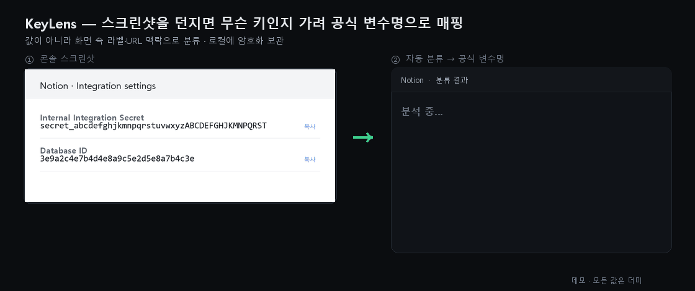

<!--
SPDX-FileCopyrightText: 2026 [Your Name]
SPDX-License-Identifier: MIT
-->

# KeyLens

> 스크린샷이나 URL을 던지면 "이건 Notion API 키, 이건 database ID"처럼 **맥락으로 정체를 가려** 공식 환경변수명에 매핑하고, 로컬에 암호화해 나만 볼 수 있게 보관하는 개인 개발자용 자격증명 관리 도구.

<p align="center">
  
</p>

<p align="center"><sub>데모 · 모든 값은 더미. 실제 앱 화면 시연 영상은 준비 중입니다.</sub></p>

## 왜 만들었나

API 연동을 하다 보면 키·토큰·ID가 끝없이 쌓입니다. 이것들은 보통 메모장이나 이름 없는 텍스트 파일에 흩어지고, 두 가지 문제를 낳습니다.

1. **이게 무슨 키인지 모른다.** 노션의 `database_id` · `data_source_id` · `page_id`는 전부 같은 32자리 UUID라 값만 봐서는 구분이 불가능합니다. 카카오는 REST/JavaScript/Admin/Native 키가 한 화면에 비슷한 모습으로 나열되고, GCP는 API 키·서비스 계정 JSON·OAuth 클라이언트가 뒤섞입니다. 기존 시크릿 스캐너(정규식 기반)는 정확히 이 지점에서 "여러 후보 가능"이라며 손을 듭니다.
2. **안전하게 보관할 곳이 없다.** 평문 메모는 유출에 취약하고, 정작 필요할 때 어떤 값이 무엇이었는지 다시 헷갈립니다.

KeyLens는 값 자체가 아니라 **출처의 맥락**(스크린샷 속 라벨, URL 구조)을 분류 신호로 사용해 이 사각지대를 해결합니다.

## 주요 기능

- **다양한 입력**: 콘솔 화면 스크린샷 붙여넣기, URL, 텍스트 붙여넣기
- **2단계 분류 엔진**
  - *Stage 1 (값 기반)*: `sk-`(OpenAI), `ghp_`(GitHub), `AKIA`(AWS) 등 접두사가 명확한 키를 정규식으로 즉시 식별
  - *Stage 2 (맥락 기반)*: 값만으로 애매한 키를 OCR로 읽은 주변 라벨("Database ID", "Internal Integration Secret")과 URL 구조로 판별. 신호가 충돌하면 단정하지 않고 "확인 필요"로 표시
- **공식 변수명 매핑**: 분류 결과를 `NOTION_DATABASE_ID`, `KAKAO_REST_API_KEY` 같은 표준 환경변수명으로 자동 정리
- **암호화 보관 (VAULT-1/2 구현 완료)**: 마스터 비밀번호에서 Argon2id로 유도한 키로 값을 AES-256-GCM 암호화해 SQLite에 **암호문만** 저장. 조회는 인증 후에만, 자동 잠금·연속 실패 지연 포함(브라우저 E2E 검증 완료)
- **조회 대시보드**: 서비스별 그룹으로 한눈에 보고, 인증 후 복사·편집·삭제. 잠금 상태에서는 값 마스킹. 만료 임박(≤14일)·만료 항목은 상단으로 정렬·뱃지 강조(TRUST-2)
- **만료일 관리 (TRUST-2)**: 만료일 수동 입력 + JWT 계열은 `exp` 클레임에서 만료일 자동 추출
- **키 유효성 검증 (TRUST-1)**: 사용자가 요청할 때 서비스의 read-only 엔드포인트(예: OpenAI `/v1/models`)로 **1회만** 호출해 키가 살아있는지(active/invalid/unknown) 확인. 값은 노출되지 않고 상태만 표시하며, 자동 주기 호출은 하지 않음. 검증 엔드포인트도 지식베이스 `verify:` 블록으로 선언 — 코드 수정 없이 서비스 확장
- **서버리스 멀티 기기 (SYNC-0)**: 금고 전체를 **암호화 번들 파일**(`.klvault.json`)로 내보내 USB·개인 클라우드로 옮기고, 다른 기기에서 마스터 비밀번호로 가져오기(교체/병합). 파일은 전부 암호문이라 비밀번호 없이는 못 열림 — 우리 서버 없이 제로 널리지로 동기화(KeePass+Dropbox 패턴)
- **확장 가능한 지식베이스 (현재 9종: Notion·Kakao·GCP·OpenAI·Ollama·GitHub·AWS·Slack·Stripe)**: 서비스별 키 종류·라벨·URL 패턴·변수명·검증 엔드포인트가 YAML로 선언되어 있어, **YAML 파일 하나 추가로 백엔드·프론트 양쪽에 자동 반영** (프론트는 부팅 시 `/knowledge`를 읽어 종류맵·서비스 목록을 동적 구성 — 코드 수정 불필요)

## 아키텍처

```
[ React + TypeScript 프론트엔드 ]        ←→  [ FastAPI 로컬 백엔드 ]
  └─ OCR (tesseract.js — 브라우저 WASM,        ├─ 분류 엔진 (Stage1 값 기반 / Stage2 맥락 기반)
     이미지가 기기를 떠나지 않음)                ├─ 지식베이스 로더 (knowledge/*.yaml)
                                              └─ 암호화 저장소 (Argon2id + AES-256-GCM,
                                                                 SQLite 암호문만 · 인증 게이트)
```

**로컬 우선(local-first)**: 외부 서버·클라우드가 없습니다. 모든 데이터는 사용자 기기에만 존재하며 네트워크로 전송되지 않습니다.

## 설치 및 실행

로컬에서 5분이면 실행됩니다. **아무 데이터도 외부로 나가지 않으며**, 각자 자기 기기에서 독립적으로 동작합니다.

### 요구 사항

| 도구 | 버전 | 확인 | 설치 |
|---|---|---|---|
| Python | 3.11+ | `python --version` | https://www.python.org/downloads/ |
| Node.js | 20+ | `node --version` | https://nodejs.org/ (LTS 권장) |
| Git | 아무 최신 | `git --version` | https://git-scm.com/downloads |

> OCR은 브라우저 안에서 tesseract.js(WASM)로 동작합니다 — 별도 설치가 필요 없고,
> 필요한 로컬 자산은 `npm run dev`/`npm run build` 시 자동으로 벤더링됩니다(`scripts/vendor-tesseract.mjs`).

### 1) 내려받기

```bash
git clone https://github.com/ttogle918/key-manager.git
cd key-manager
```

### 2) 처음 한 번: 의존성 설치

```bash
# 백엔드 (venv 권장)
cd backend && python -m venv .venv
.venv\Scripts\activate      # Windows  (macOS/Linux: source .venv/bin/activate)
pip install -r requirements.txt
cd ..

# 프론트엔드
cd frontend && npm ci && cd ..
```

### 3) 실행 — 한 번에 (권장)

백엔드(:8003)와 프론트엔드(:5173)를 한 명령으로 동시에 띄웁니다. `backend/.venv`가 있으면 자동으로 사용합니다.

```bash
node scripts/dev.mjs
```

브라우저에서 `http://localhost:5173` 접속 → 최초 실행 시 마스터 비밀번호를 설정하면 암호화 금고가 생성됩니다. `Ctrl+C`로 둘 다 종료.

> **내 데이터는 어디에 저장되나?** 암호화된 금고는 `backend/vault.db`(SQLite, 암호문만) 하나에 담깁니다.
> 이 파일과 마스터 비밀번호만 있으면 어느 기기에서든 복원됩니다(내보내기/가져오기는 보관함 화면에서). `.gitignore`에 포함되어 실수로 커밋되지 않습니다.

---

### 실행 — 개별 기동 (수동)

<details><summary>백엔드/프론트를 따로 띄우려면</summary>

#### 백엔드

```bash
cd backend
python -m venv .venv
# Windows
.venv\Scripts\activate
# macOS/Linux
source .venv/bin/activate

pip install -r requirements.txt
uvicorn app.main:app --port 8003
```

> 백엔드는 로컬 전용입니다. `--host` 옵션으로 외부에 노출하지 마세요(기본 127.0.0.1 유지).

#### 프론트엔드

```bash
cd frontend
npm ci
npm run dev
```

</details>

브라우저에서 `http://localhost:5173` 접속 → 최초 실행 시 마스터 비밀번호를 설정하면 금고가 생성됩니다.

### 빠른 체험

1. 데모 이미지(`docs/demo/notion.png`·`kakao.png`·`gcp.png`·`openai.png`, 전부 더미 값)를 입력 화면에 드래그·붙여넣기
2. 브라우저 안에서 OCR(tesseract.js) → 값과 라벨이 자동 분류되어 `NOTION_API_KEY`, `NOTION_DATABASE_ID` 등으로 매핑된 카드 확인 (이미지는 기기를 떠나지 않음)
3. 최초 실행 시 마스터 비밀번호로 금고 생성 → 확정 후 값이 AES-256-GCM으로 암호화되어 저장, 보관함에서 인증 후 조회·복사(잠금 시 값 마스킹)

> ⚠️ 체험 시에도 실제 발급 키 대신 더미 값 사용을 권장합니다. 데모·문서의 모든 예시는 명백한 가짜 값(`sk-xxxxxxxx` 등)입니다.

### 문제 해결 (자주 겪는 것)

| 증상 | 원인·해결 |
|---|---|
| PowerShell에서 `.venv\Scripts\activate` 가 막힘 | 실행 정책 때문. `Set-ExecutionPolicy -Scope Process RemoteSigned` 후 다시 시도 (또는 `python -m venv` 없이 시스템 파이썬으로 `pip install` 해도 됨) |
| `python` 명령이 없음 | macOS/Linux는 `python3`/`pip3` 를 쓰세요. Windows는 python.org 설치 시 "Add to PATH" 체크 |
| 포트 충돌(`:8003`/`:5173` 사용 중) | 기존 프로세스 종료 후 재시도. 백엔드 포트는 `uvicorn app.main:app --port <다른포트>` 로 변경 가능 |
| 브라우저가 "백엔드 미연결" 토스트 | 백엔드가 안 떠 있음. `node scripts/dev.mjs` 로 함께 띄우거나 백엔드를 먼저 실행 |
| `npm ci` 실패 | Node 20+ 인지 확인(`node --version`). `npm install` 로 대체 시도 |
| OCR/이미지 인식이 느림 | 최초 1회 WASM·언어데이터 로딩이 있습니다(로컬 벤더링, 네트워크 아님). 이후엔 빠릅니다 |

## 보안 설계

> ✅ **구현 상태**: 암호화 저장(VAULT-1)·인증 게이트(VAULT-2)가 구현되어 아래 설계(SPEC 6장)대로 동작합니다
> (backend `crypto.py`·`vault_repo.py`·`vault_session.py`, pytest 검증 + 브라우저 E2E 검증 완료).

- **키 유도**: 마스터 비밀번호 → Argon2id로 암호화 키 유도. 솔트만 저장하며 유도된 키는 메모리에만 존재, 잠금 시 폐기
- **암호화**: 항목별 AES-256-GCM(인증 암호화), 매 암호화마다 고유 nonce. 무결성 태그로 변조 탐지
- **저장**: SQLite에는 암호문·nonce·메타데이터만 저장 — 평문 값 컬럼 자체가 없음
- **접근 통제**: 조회·복사·내보내기 전 인증 필수, 일정 시간 후 자동 잠금, 연속 인증 실패 시 지연

**방어 범위 밖(한계)**: 이미 장악된 호스트(키로거, 메모리 덤프), 약한 마스터 비밀번호. 이 도구는 분실·도난 기기의 디스크 접근, 파일 유출, 저장소 직접 열람으로부터 보호합니다.

## 새 서비스 추가하기

`knowledge/` 디렉토리에 YAML 하나를 추가하면 됩니다.

```yaml
service: example
display_name: Example Service
credentials:
  - kind: api_key
    label_patterns: ["Secret key", "시크릿 키"]
    url_patterns: []
    value_regex: "^ex_[A-Za-z0-9]{24,}$"   # 접두사가 명확할 때만
    official_env_name: EXAMPLE_API_KEY
    expiry_known: false
```

자세한 절차는 [CONTRIBUTING.md](./CONTRIBUTING.md)를 참고하세요. 기여 환영합니다.

- 기여 가이드: [CONTRIBUTING.md](./CONTRIBUTING.md) · 행동 강령: [CODE_OF_CONDUCT.md](./CODE_OF_CONDUCT.md)
- 보안 취약점 신고: [SECURITY.md](./SECURITY.md) (공개 이슈 금지, 비공개로)
- 변경 이력: [CHANGELOG.md](./CHANGELOG.md)

## 배포 (다른 사람도 쓰게 하기)

KeyLens는 **각 사용자가 자기 기기에서 실행**하는 로컬 앱입니다("서버에 올려 여럿이 접속"하는 형태가 아닙니다 — 그러면 키가 기기를 떠나 제로 널리지가 깨집니다). 그래서 "남들도 쓰게" = **배포**입니다.

- **소스 배포**: 위 설치 절차대로 `git clone` → 실행. 개발자라면 이걸로 충분합니다.
- **데스크톱 앱**: 브라우저·터미널 없이 **네이티브 창 하나**로 실행 — `python desktop/app.py`(PyWebView). 여전히 100% 로컬. 사용법은 [`desktop/README.md`](./desktop/README.md).
- **더블클릭 설치 파일(예정)**: 위 데스크톱 앱을 단일 실행 파일(.exe/.app)로 패키징해 [GitHub Releases](https://github.com/ttogle918/key-manager/releases)에 배포. 랜딩 페이지·블로그에서 그 Releases로 링크하면 됩니다(다운로드 페이지는 정적 파일만 제공 — 사용자 키를 만지지 않으므로 안전).

## 로드맵

- ✅ **암호화 금고 내보내기/가져오기**(구현 완료): 암호문 번들 파일을 개인 클라우드·USB로 옮겨 다른 기기에서 마스터 비밀번호로 열기 — 서버 없는 멀티 기기
- ✅ **데스크톱 앱**(PyWebView, `desktop/app.py`): 네이티브 창으로 로컬 실행 — 완료. 남은 건 단일 실행 파일(.exe/.app) 패키징(permissive 패키저로)뿐
- **Google Drive 제로 널리지 동기화**: 사용자 본인의 Drive 앱 전용 폴더(appDataFolder)에 암호문만 자동 업로드/다운로드. 복호화 열쇠는 항상 로컬의 마스터 비밀번호이며, 자체 서버는 만들지 않음
- **DOM 기반 자동 캡처**(브라우저 확장): 권한 모델·프라이버시 설계 검증 후 도입
- 더 많은 서비스 지식베이스, 런타임 주입(SDK)

## 라이선스

MIT — [LICENSE](./LICENSE) 참조.
서드파티 의존성 및 참고 출처는 [THIRD-PARTY-NOTICES.md](./THIRD-PARTY-NOTICES.md)에 정리되어 있습니다.
