<!--
SPDX-FileCopyrightText: 2026 [Your Name]
SPDX-License-Identifier: MIT
-->
# KeyLens 설계 다이어그램

> 코드 기준 최신 상태(브랜치 `main`, RUNTIME-1 데스크톱 승인 알림 포함)를 반영한 설계도 모음입니다.
> 기능 하나하나의 설명은 [FEATURES.md](./FEATURES.md), 배경·차별점·한계는 [RESULT_REPORT.md](./RESULT_REPORT.md)를 참고하세요.
> 이 문서는 **구조**(무엇이 무엇과 연결되는가)에 집중합니다 — 다이어그램은 전부 [Mermaid](https://mermaid.js.org/) 코드로,
> GitHub·대부분의 마크다운 뷰어에서 그대로 렌더링됩니다.

## 지금 실제로 되는 기능 (요약)

| 영역 | 상태 | 비고 |
|---|---|---|
| 값 기반 분류 (Stage1) | ✅ 완료 | 10종 서비스, `value_regex` |
| 맥락 기반 분류 (Stage2, 차별점) | ✅ 완료 | 라벨·URL 신호, 충돌 시 사용자 선택 |
| 브라우저 OCR (스크린샷 → 라벨-값) | ✅ 완료 | tesseract.js, 로컬 실행 |
| 암호화 금고 (Argon2id + AES-256-GCM) | ✅ 완료 | SQLite, 평문 컬럼 없음 |
| 인증 게이트 (세션·자동잠금·실패지연) | ✅ 완료 | |
| 감사 이력 · 키 회전 · 값 마스킹 | ✅ 완료 | |
| 키 유효성 검증 (TRUST-1) | ✅ 완료 | 명시적 1회 호출만 |
| 만료일 관리 (TRUST-2) | ✅ 완료 | JWT `exp` 자동 추출 |
| 금고 번들 내보내기/가져오기 (SYNC-0) | ✅ 완료 | 서버 없는 멀티 기기 |
| 발급 도움말 · 보안 등급 (GUIDE-1/2) | ✅ 완료 | 딥링크 화이트리스트 |
| 데스크톱 앱 (PyWebView, exe 패키징) | ✅ 완료 | cx_Freeze |
| **RUNTIME-1 — SDK 백엔드**(`/sdk/*`) | ✅ 완료 | 컬렉션별 허용 디렉토리·승인 대기열·env 값 병합 |
| **RUNTIME-1 — 승인 대기 화면**(`PendingScreen`) | ✅ 완료 | 사이드바 배지·목록·허용/거부 |
| **RUNTIME-1 — 데스크톱 알림**(`notify.py`) | ✅ 완료 | 작업표시줄 깜빡임·OS 토스트·화면 자동 전환(Windows) |
| RUNTIME-1 — `keylens-env` PyPI 패키지 | ⏳ 미착수 | SDK를 실제로 배포할 클라이언트 라이브러리 자체 |
| RUNTIME-1 — 프론트 "디렉토리 등록" 설정 화면 | ⏳ 미착수 | 지금은 승인 대기 목록만 있음(사전 등록 UI 없음) |
| SYNC-2(계정 로그인 서버 동기화) | 📋 로드맵 | 설계만 확정, 이번 범위 아님 |

---

## 1. 아키텍처 개요 (컴포넌트 다이어그램)

브라우저(OCR·UI), 로컬 FastAPI(분류·암호화·SDK 게이트), 선택적 데스크톱 런처(PyWebView + 알림) 세 계층이 전부
한 기기 안에서 협업합니다. 외부 서버는 없습니다.

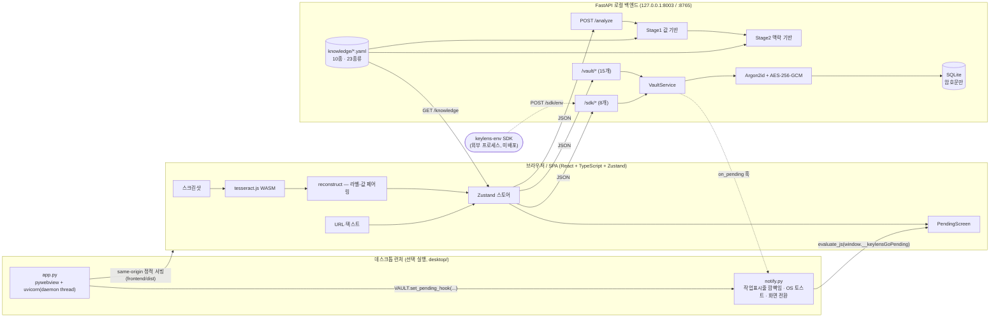

---

## 2. 유스케이스 다이어그램

Mermaid에는 UML 유스케이스 전용 표기법이 없어, 액터 → 시스템 경계 안 유스케이스로 표현하는 통용 방식을 씁니다.

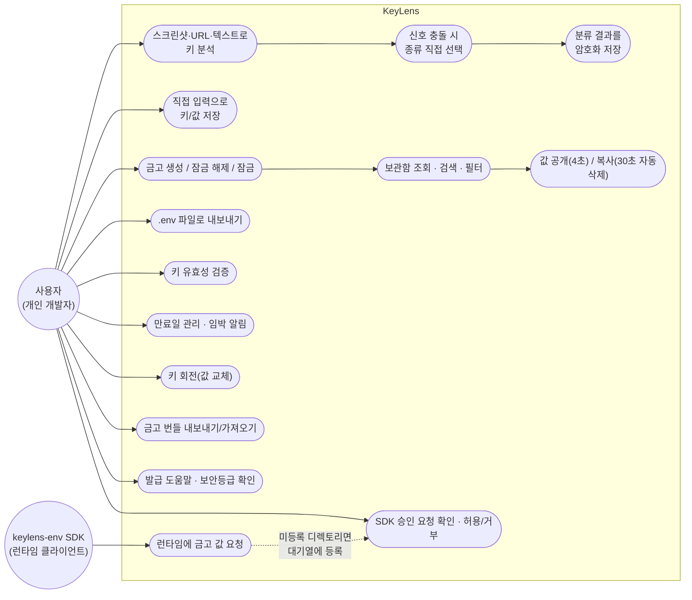

---

## 3. 클래스 다이어그램

### 3.1 백엔드 — 도메인 모델 + 서비스 계층

`vault_repo.py`/`sdk_repo.py`는 클래스가 아니라 `sqlite3.Connection`을 받는 함수 모듈이지만,
`VaultService`가 이들을 감싸는 파사드 역할을 하므로 `<<module>>`로 표시했습니다.

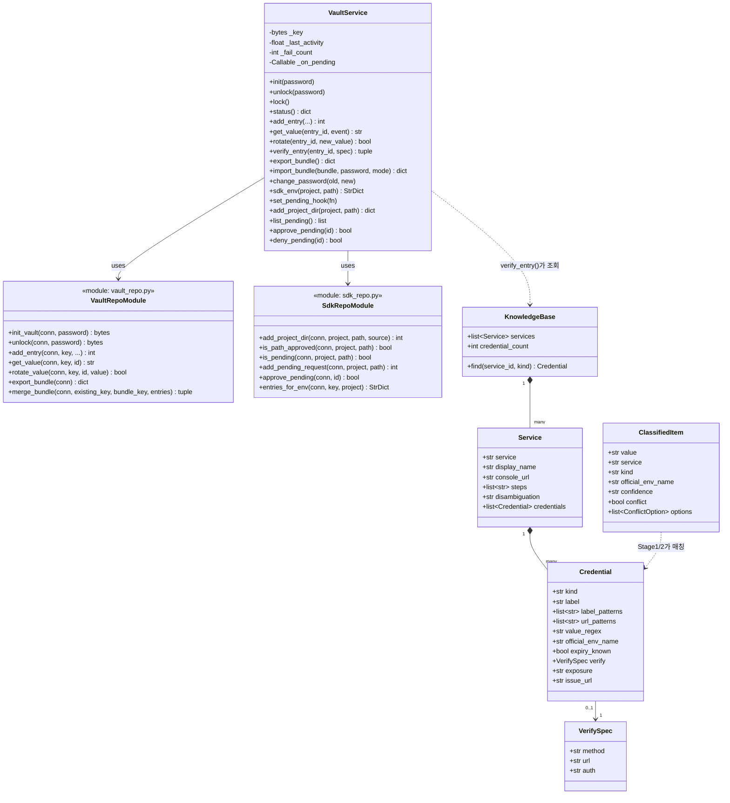

### 3.2 프론트엔드 — 상태(Zustand 스토어) + 핵심 타입

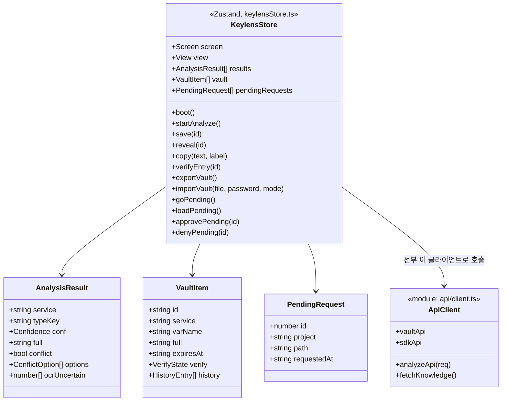

---

## 4. 데이터 모델 (SQLite 스키마, `vault.db`)

암호화 값 자체는 `nonce`/`ciphertext` BLOB로만 존재하고, 평문 값 컬럼은 어떤 테이블에도 없습니다.

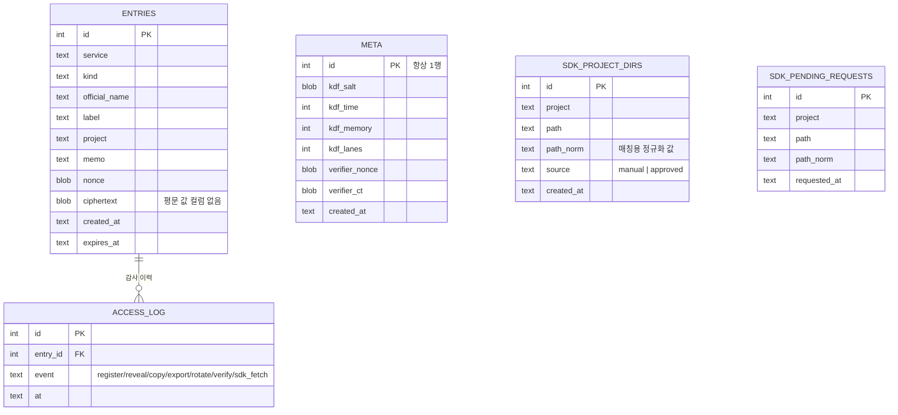

> `SDK_PROJECT_DIRS`/`SDK_PENDING_REQUESTS`는 `ENTRIES`와 외래키로 묶이지 않습니다 — `project` 문자열로만
> 느슨하게 연결됩니다(`sdk_env()`가 조회 시점에 두 값을 나란히 읽어 병합). `UNIQUE(project, path_norm)`으로
> 같은 (컬렉션, 경로) 조합의 중복 등록/중복 대기를 막습니다.

---

## 5. 시퀀스 다이어그램 (핵심 흐름)

### 5.1 스크린샷 → 분류 → 저장

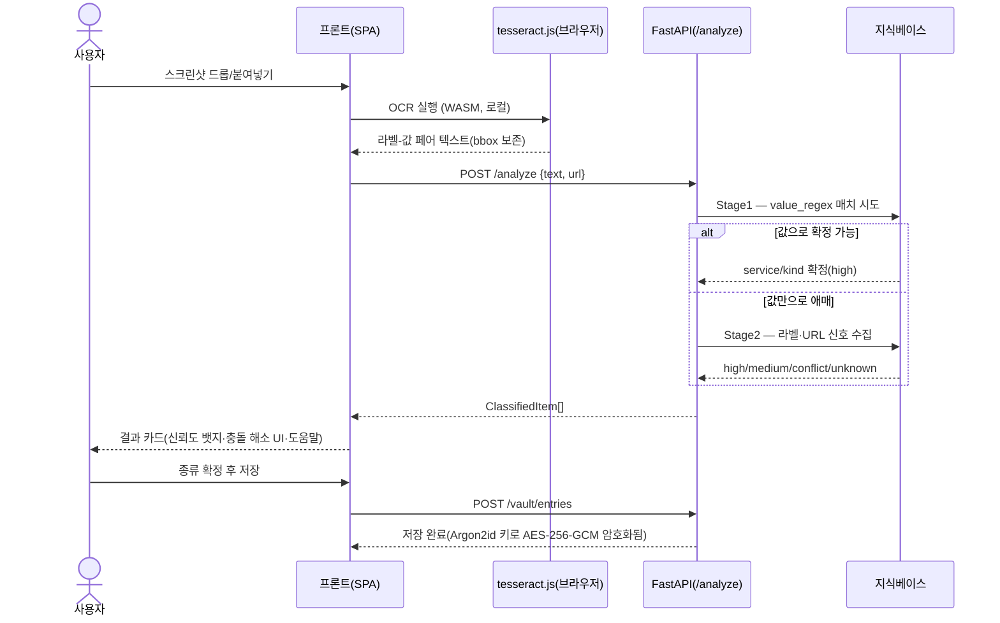

### 5.2 잠금 해제(인증)

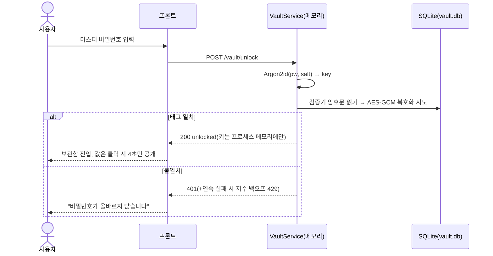

### 5.3 RUNTIME-1 — SDK 승인 요청 → 데스크톱 알림 → 허용/거부

이번에 새로 구현된 흐름입니다. 알림 작업은 데몬 스레드에서 비동기로 실행되어, `evaluate_js`가 느려도
SDK 요청(`POST /sdk/env`) 자체는 즉시 응답합니다.

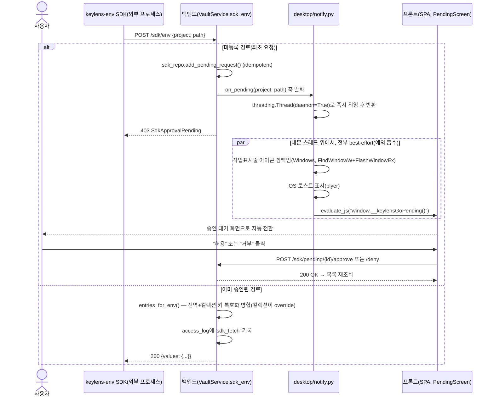

### 5.4 금고 번들 내보내기/가져오기 (SYNC-0)

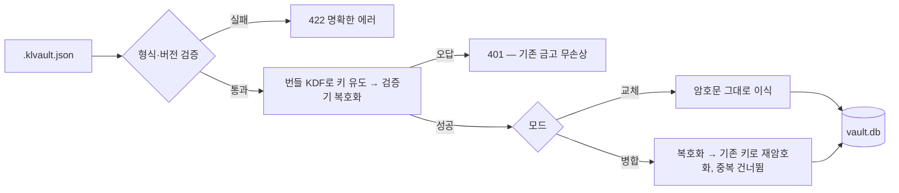

---

## 6. 상태 다이어그램

### 6.1 금고 세션

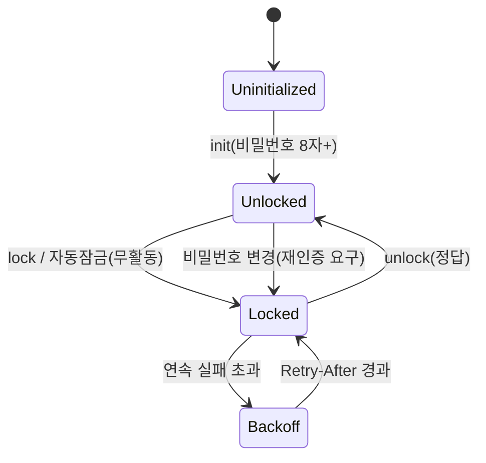

### 6.2 SDK 승인 요청 (RUNTIME-1)

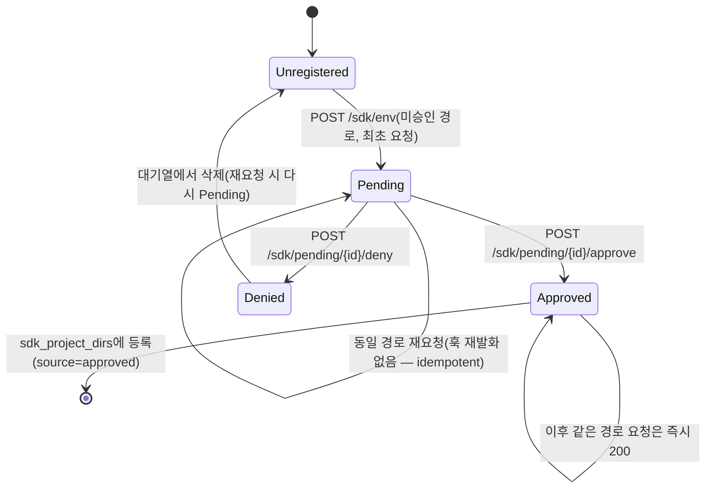

---

## 참고

- 이 문서의 다이어그램은 브랜치 `main`(RUNTIME-1 데스크톱 알림 병합 시점) 코드를 기준으로 손으로 맞춘 것입니다 —
  자동 생성이 아니므로 코드가 바뀌면 이 문서도 함께 갱신해야 합니다.
- 값 기반/맥락 기반 분류 알고리즘 자체의 세부 흐름도(Stage1/Stage2 판정 트리)는 [FEATURES.md](./FEATURES.md#1-분류매핑-엔진)에 더 상세히 있습니다 — 이 문서와 중복되지 않게 링크만 겁니다.
