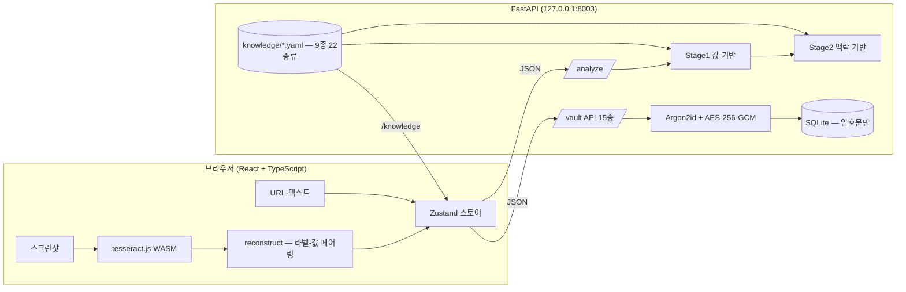
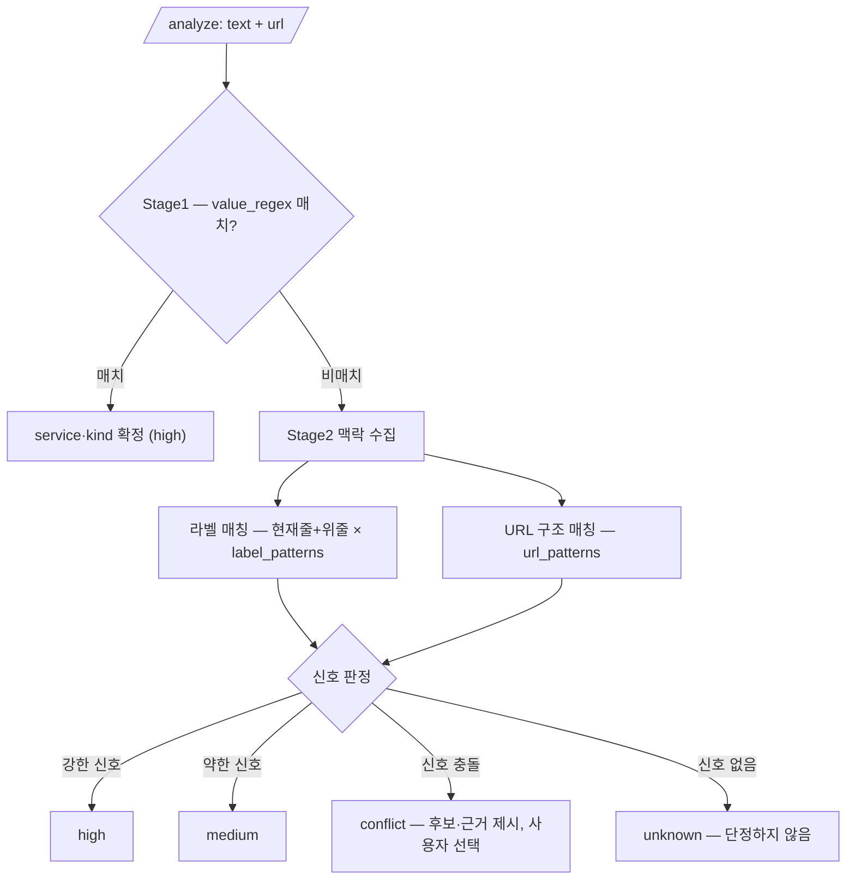
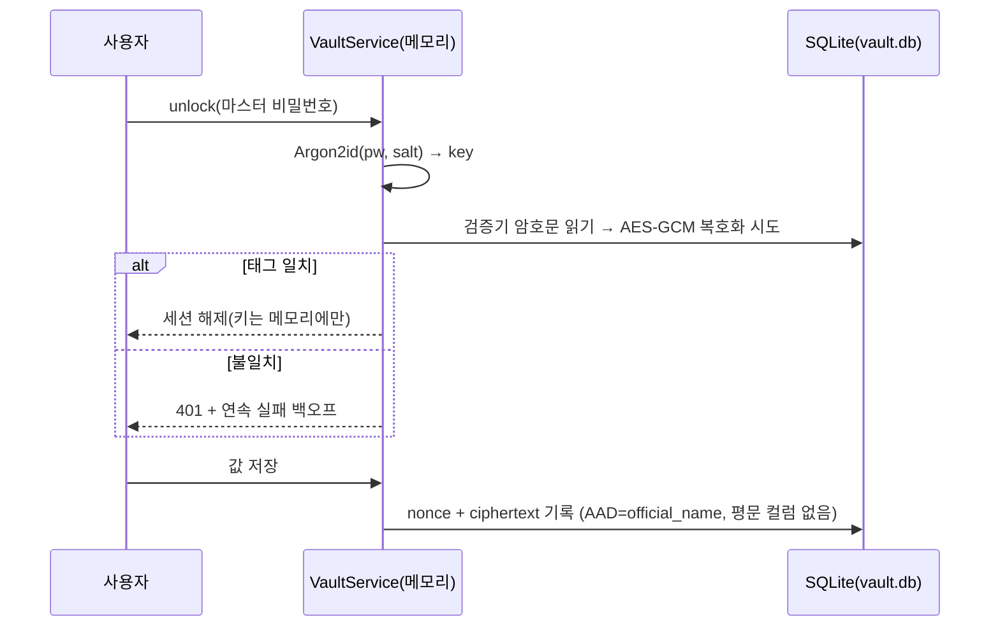
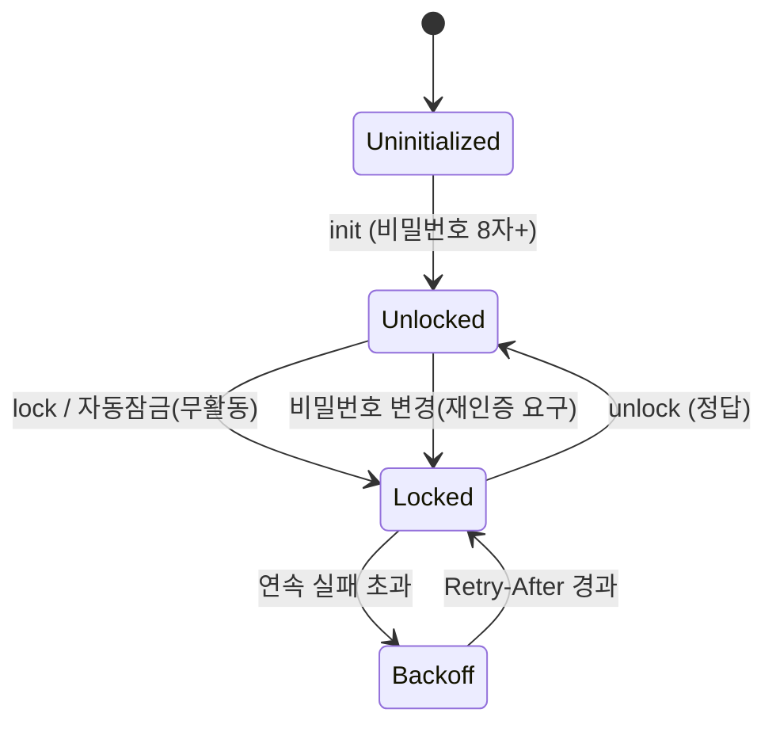
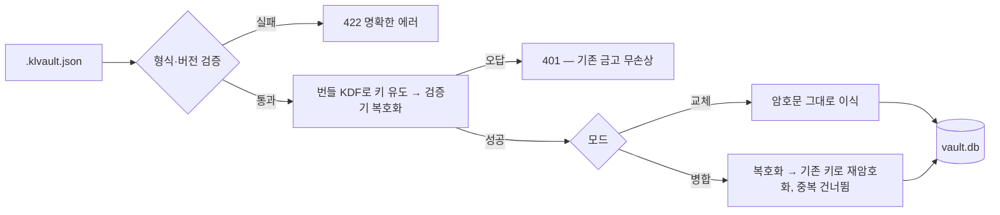

<!--
SPDX-FileCopyrightText: 2026 [Your Name]
SPDX-License-Identifier: MIT
-->
# KeyLens 기능 문서

> 전체 기능을 영역별로 정리한 카탈로그입니다. 설치·실행은 [루트 README](../README.md),
> 설계 배경·차별점·한계는 [결과보고서](./RESULT_REPORT.md)를 참고하세요.

| 한눈에 | |
|---|---|
| 지원 서비스 / 자격증명 종류 | **9종 / 22종류** (Notion·Kakao·GCP·OpenAI·Ollama·GitHub·AWS·Slack·Stripe) |
| API 엔드포인트 | **18개** (분석 1 · 지식베이스 2 · 금고 15) |
| 테스트 | 백엔드 pytest **149** · 프론트 vitest **28** + 브라우저 E2E |
| 라이선스 / 보안 | 카피레프트 의존성 **0** · 알려진 CVE **0** · 런타임 외부 요청 **0** |

## 전체 구조

브라우저(OCR·UI)와 로컬 FastAPI(분류·암호화)가 한 기기 안에서 협업합니다.
이미지·키·폰트까지 전부 로컬에 머물며, 유일한 아웃바운드는 사용자가 명시적으로 실행하는
키 유효성 검증(TRUST-1)뿐입니다.

---

## 1. 분류·매핑 엔진

### Stage1 — 값 기반 분류

접두어가 명확한 키(`sk-` OpenAI, `ghp_` GitHub, `AKIA` AWS, `AIza` GCP, `xoxb-` Slack,
`sk_live_` Stripe 등)를 지식베이스의 `value_regex`만으로 즉시 **high** 신뢰도로 식별합니다.
값 규칙 = 지식베이스 파일이므로 YAML 하나로 검출 범위가 늘어납니다.

- 접두어 없는 애매값(UUID·32hex)은 단정하지 않고 `unknown`으로 안전 분류(오식별 방지)
- 엔트로피 보조 판정으로 평문·일반 텍스트 필터링
- `NAME=VALUE`에서 값이 `#`·따옴표에서 잘렸을 가능성은 `meta.truncated`로 표식 → 카드 경고

관련: `backend/app/classify/stage1.py` · `backend/app/masking.py`

### Stage2 — 맥락 기반 분류 (차별점)

노션의 database/data_source/page ID는 전부 같은 32자 UUID라 값만으로는 구분이 불가능합니다.
Stage2는 **값 주변 라벨**(현재 줄 + 바로 위 줄)을 `label_patterns`와 대조하고,
**URL 구조**(`notion.so/…?v=` 앞 = Database ID, 마지막 세그먼트 = Page ID)를 `url_patterns`로
매칭해 정체를 가립니다.

- 신호 강도가 신뢰도가 됨: 강한 신호 = high, 약한 신호 = medium
- 신호가 충돌하면 **단정하지 않고** `conflict` + 후보 목록(근거·신호 강약)을 반환 → 사용자가 선택
- 충돌 카드에는 지식베이스의 **구분법**(`disambiguation`) 힌트가 함께 표시됨

관련: `backend/app/classify/stage2.py` · `backend/app/classify/pipeline.py`

### 브라우저 OCR — 스크린샷 → 라벨-값 페어

OCR이 **브라우저 안**(tesseract.js WASM, 한글+영문)에서 실행되어 이미지가 기기를 떠나지 않습니다.
단순 텍스트 추출이 아니라 word 박스(bbox)를 행으로 그룹핑해 **라벨과 값의 위치 관계**를
보존하는 것이 핵심 — 이것이 Stage2의 입력이 됩니다.

- **값 전용 정밀 재인식**: 값 토큰 bbox만 크롭해 PSM(단일 라인)+문자셋 제한으로 2차 인식.
  1차와 길이가 같을 때만 채택(길이 가드)해 `i↔1` 오독을 교정하면서 퇴행은 자동 거부
- **신뢰도 플래깅**: OCR이 이어붙인 이음매 위에 빨간 `v` 표식 — "여기 확인하세요"를 시각화
- 마스킹된 값(`••••`)은 `[마스킹됨]` 치환 — 가짜 값 분류를 만들지 않음
- WASM·언어데이터는 빌드 시 로컬 벤더링(런타임 CDN 없음)

관련: `frontend/src/ocr/ocr.ts` · `frontend/src/ocr/reconstruct.ts` · `frontend/scripts/vendor-tesseract.mjs`

### 지식베이스 — YAML 하나로 서비스 확장

서비스별 키 종류·라벨 사전·URL 패턴·값 정규식·공식 변수명·검증 엔드포인트·발급 도움말·보안
등급이 전부 `knowledge/*.yaml` **데이터**로 선언됩니다.

- 기동 시 스키마 검증(pydantic)·중복 변수명 차단·정규식 컴파일 검증 — 깨진 YAML은 파일명이 박힌 에러
- 프론트는 부팅 시 `GET /knowledge`로 종류맵·서비스 목록을 **런타임 구성** — 새 서비스는
  **프론트 코드 0줄**로 자동 반영(미지 서비스는 타일·색 자동 부여)
- 새 서비스 추가 절차: [CONTRIBUTING.md](../CONTRIBUTING.md)

관련: `backend/knowledge/*.yaml` · `backend/app/knowledge.py` · `frontend/src/data/services.ts`

### .env 내보내기

보관된 키를 `KAKAO_REST_API_KEY=…` 표준 형식으로 직렬화(서비스 그룹·프로젝트 주석).
전체 복사·파일 다운로드·그룹별 복사를 지원하며, 접근은 `export` 이벤트로 감사 이력에
남고 모달에 평문 포함 경고가 고정 표시됩니다.

---

## 2. 암호화 금고 & 인증

### 암호화 저장소 (Argon2id + AES-256-GCM)

마스터 비밀번호에서 **Argon2id**(메모리-하드 KDF)로 키를 유도하고 — 솔트·파라미터만 저장,
키는 메모리에만 — 값은 항목별 **AES-256-GCM**(고유 nonce, 인증 태그)으로 암호화합니다.
SQLite에는 **평문 값 컬럼 자체가 없습니다**(파일 바이트 스캔 테스트로 보증).

- **비밀번호 검증기**: 고정 토큰을 키로 암호화해 저장 — 잠금 해제 시 이것만 복호화해 오답 즉시 거부
- **AAD 바인딩**: 암호문을 `official_name`에 묶어 DB에서 라벨을 바꿔치기하면 복호화가 깨짐(변조 탐지)
- **비밀번호 변경 = 전체 재암호화**(새 솔트, 원자적 — 실패 시 롤백)

관련: `backend/app/crypto.py` · `backend/app/vault_repo.py`

### 인증 게이트 — 세션·자동 잠금·실패 지연

값 조회·복사·내보내기 전 반드시 인증합니다. 유도 키는 메모리에만 존재하고 무활동
5분(환경변수로 조정) 후 자동 폐기됩니다. 연속 인증 실패는 지수 백오프(최대 30초)로
지연되며 `429 + Retry-After`로 응답합니다. 잠금 상태에서는 **메타데이터만** 노출됩니다.

관련: `backend/app/vault_session.py` (시계 주입 구조 — 자동잠금·백오프가 단위테스트로 검증됨)

### 감사 이력

키에 대한 모든 접근이 항목별로 기록됩니다: **등록·열람·복사·.env 내보내기·키 교체·유효성 검증**.
값은 이력에 담기지 않으며 복호화 성공 시에만 기록됩니다. 항목 삭제 시 이력도 함께 삭제(FK CASCADE).

### 키 회전(값 교체)

서비스에서 키를 재발급했을 때 항목을 지우지 않고 **새 값으로 재암호화**합니다(옛 암호문 폐기,
'키 교체' 이력 기록). 회전 모달에는 "먼저 새 키 발급 →" 콘솔 바로가기가 함께 제공됩니다.

### 값 마스킹·클립보드 위생

값은 기본 마스킹이며 클릭 시 **4초간만** 표시 후 자동 재마스킹됩니다(평문 즉시 제거).
복사한 값은 **30초 후 클립보드에서 자동 삭제**를 시도합니다(다른 내용을 덮어쓰지 않도록
내용 일치 확인 후). 원본 스크린샷도 값과 동일한 공개 조건에서만 표시됩니다.

---

## 3. 신뢰 기능

### 키 유효성 검증 (TRUST-1)

"이 키가 살아있나"를 실제 호출로 확인합니다. 지식베이스의 `verify:` 블록으로 선언된
**read-only GET/HEAD**만, **사용자가 버튼을 눌렀을 때 1회만** 실행합니다(자동 주기 호출 없음).

| 응답 | 상태 |
|---|---|
| 2xx | **active** — 서비스가 키를 인정 |
| 401 / 403 | **invalid** — 폐기·오타 (→ "재발급 →" 링크 표시) |
| 429·5xx·네트워크 오류 | **unknown** — 키 문제로 단정하지 않음 |
| 검증 미선언 서비스 | **unsupported** — 호출 자체 안 함 |

평문 키는 검증 함수 안에서만 존재하고 반환값은 상태뿐이며, 시도는 감사 이력에 남습니다.
표준 `urllib` 구현으로 새 의존성 0.

관련: `backend/app/verify.py` · `knowledge/*.yaml`의 `verify:` 블록

### 만료일 관리 (TRUST-2)

만료일 수동 입력(날짜 인풋)이 기본이고, **JWT 계열은 저장 시 `exp` 클레임에서 만료일을 자동
추출**합니다(base64url 디코드·표기 목적). 만료·임박(≤14일) 항목은 보관함 그룹 **상단 정렬** +
D-day 뱃지, 임박 시 "재발급 →" 콘솔 링크가 함께 표시됩니다.

관련: `frontend/src/lib/format.ts` (`jwtExp`·`expiryInfo`)

---

## 4. 서버리스 멀티 기기 (SYNC-0)

금고 전체를 단일 JSON 번들(`.klvault.json`)로 내보냅니다 — 포맷 버전 메타 + base64
KDF 파라미터·검증기·항목별 nonce/암호문. **평문도 유도 키도 없어**, USB·개인 클라우드로
옮겨 다른 기기에서 마스터 비밀번호로 열면 됩니다(제로 널리지).

- **교체**: 암호문 그대로 이식(빈 기기 복원)
- **병합**: 번들 키로 복호화 → 기존 금고 키로 재암호화, 중복 변수명은 건너뜀
- 오답 비밀번호 401(기존 금고 무손상) · 손상/구버전 422 명확한 에러 · 전 케이스 원자적 롤백

관련: `backend/app/vault_repo.py` (export/parse/replace/merge) · `SyncModal`

---

## 5. 발급 도움말 & 보안 등급 (GUIDE)

### 발급·역할 안내

지식베이스에 종류별 `role`(이 키가 무슨 역할인지)·`issue_url`(발급 콘솔)·`docs_url`(공식 문서),
서비스별 `steps`(발급 단계)·`prereq`(사전조건 — "GCP는 프로젝트+결제 먼저" 같은 실제 막힘
포인트)를 선언합니다. 결과 카드·보관함에서 역할 설명과 "발급받기 →"·"문서 →" 링크,
접이식 "발급 방법"을 제공합니다. 외부 링크는 새 탭 + `noopener noreferrer`만 — 자동
이동·전송이 없습니다.

### 콘솔 딥링크 + 도메인 화이트리스트

콘솔 URL의 `{project}` 플레이스홀더를 항목의 프로젝트 값이 **ID 형태일 때만** 치환해
해당 콘솔 페이지로 바로 연결하고, 아니면 기본 콘솔로 안전 폴백합니다. 최종 URL은
**지식베이스가 선언한 호스트 + https만** 통과하는 화이트리스트를 거칩니다(오픈 리다이렉트·
`javascript:` 차단).

### 노출 등급·유출 대응

같은 서비스라도 공개 가능 키와 노출 금지 키가 갈립니다(Kakao JS=공개 vs Admin=금지,
Stripe pk vs sk). 22종 전부 `exposure`(public/secret)를 지정해 **🔒 노출 금지 / 공개 가능
뱃지**로 표시하고, secret 종류엔 유출 시 피해(`impact`)와 하드닝 팁(`security_tip` —
GCP IP 제한, AWS 최소 권한 등)이 붙습니다. 검증 실패·만료 임박·키 회전 시점에 재발급
링크로 연결됩니다. 자동 폐기·자동 재발급은 하지 않습니다 — 안내까지만.

관련: `frontend/src/components/KeyHelp.tsx` · `knowledge/*.yaml`

---

## 6. 화면 & 안정성

- **입력 화면**: 스크린샷 드롭/붙여넣기 + URL + 텍스트 → 결과 카드(신뢰도 뱃지·근거·충돌
  해소·노출 등급·도움말) → 프로젝트·메모 달아 저장까지 한 흐름
- **보관함**: 서비스별 그룹, 검색·프로젝트 필터, 만료 임박 상단 정렬, 상세 펼침(이력·검증·회전),
  중복 저장 감지 다이얼로그
- **에러 처리**: ErrorBoundary(크래시 대신 복구 UI, 값 미노출), 백엔드 미연결 폴백+안내,
  401 재인증 유도, 백엔드는 빈·제어문자·거대 입력 무크래시 회귀셋

---

## 7. 실행 형태 & 배포

- **단일 명령**: `node scripts/dev.mjs` — 백엔드+프론트 동시 기동(venv 자동 감지)
- **데스크톱 앱**: `python desktop/app.py` — FastAPI에 빌드된 SPA를 same-origin 정적
  서빙 + OS 웹뷰 네이티브 창. **cx_Freeze**(permissive)로 단일 실행 파일 패키징 지원
- **로컬 벤더링**: tesseract 자산·웹폰트(OFL-1.1)를 빌드 시 로컬로 — **런타임 외부 요청 0**

---

## 8. 품질·라이선스

- **CI**(GitHub Actions): push/PR마다 백엔드 pytest · 프론트 lint/test/build ·
  reuse lint + 카피레프트 0 검사 · 취약점(pip-audit/npm audit)
- 전 소스 SPDX 헤더(REUSE 3.3 준수) · [SBOM](./SBOM.md) ·
  [THIRD-PARTY-NOTICES](../THIRD-PARTY-NOTICES.md)(정규식·도움말 데이터의 공식 문서 출처) ·
  [SECURITY.md](../SECURITY.md)(취약점 비공개 신고)
- 데모는 전부 더미 값(`docs/demo/`) — 골든 픽스처로 분류 계약 회귀 검증

---

## API 엔드포인트 전체 (18)

| 메서드 | 경로 | 설명 |
|---|---|---|
| GET | `/health` | 상태 + 서비스·credential 수 |
| GET | `/knowledge` | 지식베이스(종류맵·도움말·보안등급) — 프론트 동적 구성 |
| POST | `/analyze` | 텍스트·URL 분류(Stage1+2) |
| GET | `/vault/status` | initialized · unlocked |
| POST | `/vault/init` | 금고 생성(비밀번호 8자+ 강제) |
| POST | `/vault/unlock` | 잠금 해제(오답 401 · 백오프 429+Retry-After) |
| POST | `/vault/lock` | 세션 키 폐기 |
| GET | `/vault/entries` | 메타 목록(값 없음 — 잠금 상태에도 안전) |
| POST | `/vault/entries` | 암호화 저장(+JWT exp 자동 만료일) |
| PATCH | `/vault/entries/{id}` | project·memo·expires_at 수정 |
| DELETE | `/vault/entries/{id}` | 삭제(이력 CASCADE) |
| GET | `/vault/entries/{id}/value` | 복호화(+event: reveal/copy/export 이력) |
| GET | `/vault/entries/{id}/history` | 감사 이력(값 없음) |
| POST | `/vault/entries/{id}/rotate` | 키 회전(재암호화) |
| POST | `/vault/entries/{id}/verify` | 유효성 검증(TRUST-1) |
| POST | `/vault/export` | 암호문 번들 내보내기(인증 필요) |
| POST | `/vault/import` | 번들 가져오기(교체/병합) |
| POST | `/vault/change-password` | 전체 재암호화 → 재인증 |
