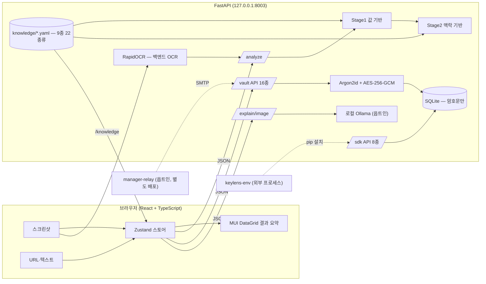

<!--
SPDX-FileCopyrightText: 2026 [Your Name]
SPDX-License-Identifier: MIT
-->
# KeyLens 기능 문서

> 전체 기능을 영역별로 정리한 카탈로그입니다. 설치·실행은 [루트 README](../README.md),
> 설계 배경·차별점·한계는 [결과보고서](./RESULT_REPORT.md)를 참고하세요.
> 각 기능의 설계 근거(왜 이렇게 결정했는지·기각한 대안)는 별도 HTML 문서로 정리돼 있습니다.

| 한눈에 | |
|---|---|
| 지원 서비스 / 자격증명 종류 | **9종 / 22종류** (Notion·Kakao·GCP·OpenAI·Ollama·GitHub·AWS·Slack·Stripe) |
| 백엔드 API 엔드포인트 | **30개** (헬스체크 1 · 분석 2 · 화면설명 2 · 지식베이스 1 · 금고 16 · SDK 8) + 매니저 릴레이(별도 배포) 2개 |
| 테스트 | 백엔드 pytest **266** · 프론트 vitest **49** + 브라우저 E2E |
| 라이선스 / 보안 | 강한 카피레프트 **0** · 약한 카피레프트 2건(조건부 허용, 근거 THIRD-PARTY-NOTICES.md) · 알려진 CVE **0** · 런타임 외부 요청 **0**(옵트인 기능 제외) |

## 전체 구조

로컬 백엔드(FastAPI, 127.0.0.1)가 OCR·분류·암호화·화면 설명을 전부 처리하고, 프론트(React)는
UI와 상태만 담당합니다. 이미지·키·폰트까지 전부 로컬에 머물며, 유일한 아웃바운드는 사용자가
명시적으로 실행하는 키 유효성 검증(TRUST-1)과, 옵트인으로 켠 화면 설명(로컬 Ollama)·이메일
동기화(SYNC-2, 별도 배포)뿐입니다.

---

## 1. 분류·매핑 엔진

### Stage1 — 값 기반 분류

접두어가 명확한 키(`sk-` OpenAI, `ghp_` GitHub, `AKIA` AWS, `AIza` GCP, `xoxb-` Slack,
`sk_live_` Stripe 등)를 지식베이스의 `value_regex`만으로 즉시 **high** 신뢰도로 식별합니다.
값 규칙 = 지식베이스 파일이므로 YAML 하나로 검출 범위가 늘어납니다.

관련: `backend/app/classify/stage1.py` · `backend/app/masking.py`

### Stage2 — 맥락 기반 분류 (차별점)

노션의 database/data_source/page ID는 전부 같은 32자 UUID라 값만으로는 구분이 불가능합니다.
Stage2는 **값 주변 라벨**과 **URL 구조**를 대조해 정체를 가립니다. 신호가 충돌하면 단정하지
않고 `conflict` + 후보 목록을 반환합니다.

관련: `backend/app/classify/stage2.py` · `backend/app/classify/pipeline.py`

### 백엔드 OCR (RapidOCR) — 스크린샷 → 라벨-값 페어

OCR이 **로컬 백엔드**(127.0.0.1, PP-OCRv5 한국어 인식 모델)에서 실행됩니다. 초기에는 브라우저
`tesseract.js`(WASM)를 썼으나 한글 단일 글자 라벨 오독 문제로 이 경로로 교체했습니다 — 이미지는
여전히 이 기기 안에서만 처리되고 디스크에 저장되지 않습니다.

- **값 전용 정밀 재인식**: 값 토큰 영역만 크롭해 2차 인식, 길이 가드로 퇴행 자동 거부
- 옛 브라우저 경로(`frontend/src/ocr/*`)는 재구성 로직 회귀 테스트용으로만 남아 있음(현재 미호출)

관련: `backend/app/ocr.py` · `backend/scripts/vendor_ocr_models.py`

### 지식베이스 — YAML 하나로 서비스 확장

서비스별 키 종류·라벨 사전·URL 패턴·값 정규식·공식 변수명·검증 엔드포인트·발급 도움말·보안
등급이 전부 `knowledge/*.yaml` 데이터로 선언됩니다. 새 서비스는 **프론트 코드 0줄**로 자동
반영됩니다(`/knowledge` 런타임 소비).

관련: `backend/knowledge/*.yaml` · `backend/app/knowledge.py` · [CONTRIBUTING.md](../CONTRIBUTING.md)

### `.env` 내보내기

보관된 키를 표준 형식으로 직렬화(전체/그룹별 복사·파일 다운로드). 접근은 감사 이력에 남고
평문 포함 경고가 고정 표시됩니다.

---

## 2. 화면 설명 (신규, 옵트인)

"이 화면 설명해줘" 버튼으로 스크린샷 전체를 박스+라벨 오버레이로 설명합니다. 지식베이스에
이미 등록된 서비스는 즉시 라벨링하고, 미등록 영역만 사용자가 이미 실행 중인 **로컬 Ollama**에
짧은 설명을 요청합니다. 앱은 어떤 LLM 가중치도 포함하지 않으며, `OLLAMA_MODEL` 환경변수가
없으면 버튼 자체가 화면에 나타나지 않습니다(조용한 저성능 대체 없음).

관련: `frontend/src/components/modals/ExplainModal.tsx` · `backend/app/explain.py` ·
`backend/app/ollama_client.py` · `docs/AI_MODEL_DISCLOSURE.md`

---

## 3. 암호화 금고 & 인증

### 암호화 저장소 (Argon2id + AES-256-GCM)

마스터 비밀번호에서 Argon2id로 키를 유도하고, 값은 항목별 AES-256-GCM(고유 nonce)으로
암호화합니다. SQLite에는 평문 값 컬럼 자체가 없습니다.

관련: `backend/app/crypto.py` · `backend/app/vault_repo.py`

### 인증 게이트 — 세션·자동 잠금·실패 지연

값 조회·복사·내보내기 전 반드시 인증합니다. 무활동 자동 잠금, 연속 실패 지수 백오프
(`429 + Retry-After`). 잠금 상태에서는 메타데이터만 노출됩니다.

관련: `backend/app/vault_session.py`

### 감사 이력 · 키 회전 · 값 마스킹

모든 접근(등록·열람·복사·내보내기·회전·검증)이 기록되며 값은 담기지 않습니다. 재발급 시
새 값으로 재암호화(키 회전)하고, 값은 클릭 시 4초만 표시·클립보드는 30초 후 자동 삭제됩니다.

### 금고 완전 초기화 (VAULT-RESET)

교육·공용 PC에서 마스터 비밀번호 재확인 후 버튼 하나로 금고를 완전히 비웁니다(`POST
/vault/reset`). 항목·감사 이력·메타(마스터 비밀번호 검증기)뿐 아니라 RUNTIME-1의 SDK 디렉토리
승인 기록까지 지워 다음 사용자에게 흔적이 안 남습니다. 인증은 `change-password`와 동일하게
세션 잠금 해제 여부와 무관하게 비밀번호 자체를 재검증합니다.

관련: `backend/app/vault_repo.py`(`reset_vault`) · `backend/app/vault_session.py` ·
`docs/superpowers/specs/2026-08-27-vault-full-reset-design.md`

---

## 4. 조회 대시보드 (보관함)

- **프로젝트별 아코디언 그룹**(최근 개편) — 서비스별 그룹에서 프로젝트별 그룹으로 전환. 서비스는
  상단 **로고 태그**(6종, `simple-icons` 벤더링)로 승격돼 프로젝트 횡단 필터 역할을 합니다
- 프로젝트 미지정 시 등록일을 실제 `project` 값으로 자동 저장(빈 버킷 방지, `keylens-env`의
  "미지정 = 전역 키" 규칙과 충돌 방지)
- MUI DataGrid 결과 요약 표, 검색·만료 임박 상단 정렬, 중복 저장 감지 다이얼로그

관련: `frontend/src/components/screens/VaultScreen.tsx` · `frontend/src/components/input/ResultsGrid.tsx` ·
`docs/superpowers/specs/2026-08-27-vault-project-grouping-design.md`

---

## 5. 신뢰 기능

### 키 유효성 검증 (TRUST-1)

지식베이스의 `verify:` 블록으로 선언된 read-only 엔드포인트를 **사용자가 버튼을 눌렀을 때 1회만**
호출합니다(현재 OpenAI·Notion 선언). 응답: active/invalid/unknown/unsupported.

관련: `backend/app/verify.py`

### 만료일 관리 (TRUST-2)

수동 입력 + JWT `exp` 클레임 자동 추출. 임박(≤14일) 항목은 상단 정렬 + 뱃지.

---

## 6. 서버리스 멀티 기기 & 이메일 전달

### 암호화 번들 내보내기/가져오기 (SYNC-0)

금고 전체를 단일 JSON 번들(`.klvault.json`)로 내보내 USB·개인 클라우드로 옮깁니다(제로 널리지).
교체/병합 두 모드를 지원합니다.

관련: `backend/app/vault_repo.py`(export/import) · `SyncModal`

### 이메일 릴레이 동기화 (SYNC-2) — `manager-relay/`

계정·DB 없이 **SMTP로만** 목적지 이메일에 암호화 번들을 전달하는 **독립 배포형 서비스**입니다.
KeyLens 앱 자체가 서버를 운영하지 않고, 이 기능을 쓰고 싶은 운영자("매니저")가 자기 SMTP
자격증명으로 직접 배포해야 동작합니다. 2단계 발송(확인 메일 → 클릭 → 첨부 메일)으로 임의
주소로의 스팸 발송을 막습니다.

- 매니저와 그의 메일 제공자는 서비스명·라벨·프로젝트·메모 같은 **메타데이터**는 볼 수 있지만
  비밀 값은 암호문이라 볼 수 없습니다(README에 명시)
- 토큰은 인스턴스 메모리 + TTL(15분)만 — 영구 저장소 없음

관련: `manager-relay/`(독립 프로젝트, `README.md` 참고) ·
`docs/superpowers/specs/2026-08-26-sync2-email-relay-design.md`

### Google Drive 자동 동기화 (SYNC-1) — 로드맵

처음부터 이번 범위 밖. OAuth `drive.appdata` 스코프만 사용하는 설계 메모만 존재.

---

## 7. 런타임 키 주입 SDK — `keylens-env/`

`dotenv` 대체 런타임 SDK(Python). `keylens_env.load_env()` 한 줄이면 디스크에 평문 `.env` 파일을
남기지 않고, 실행 중이고 잠금 해제된 KeyLens에서 그때그때 값을 `os.environ`에 주입합니다.

- **프로젝트 그룹 단위 접근범위**: 프로젝트 지정 키는 등록된 디렉토리에서만, 미지정("기본") 키는
  전역. 이름이 겹치면 프로젝트 쪽이 우선
- **승인 프롬프트**: 미등록 디렉토리가 처음 요청하면 KeyLens 앱에 승인 팝업(OAuth 동의창과 비슷한 패턴)
- **알림**: 데스크톱 앱은 OS 네이티브 토스트 + 작업표시줄 깜빡임(Windows). 브라우저 dev 모드는
  Web Notification 대체 + 화면 안 배너(스코프 하)
- 새 런타임 의존성 0 — 표준 라이브러리 `urllib`만 사용, git 설치 배포(PyPI 미등록)

관련: `keylens-env/`(독립 패키지, `README.md` 참고) · `backend/app/sdk_repo.py` ·
`frontend/src/components/screens/ProjectAccessScreen.tsx` · `PendingScreen.tsx`

---

## 8. 발급 도움말 & 보안 등급 (GUIDE)

지식베이스에 종류별 역할·발급 콘솔·공식 문서, 서비스별 발급 단계·사전조건을 선언합니다.
콘솔 URL의 `{project}` 플레이스홀더를 항목 값으로 치환해 딥링크하고(ID 형태일 때만, 도메인
화이트리스트 통과), 22종 전부에 노출 등급(🔒 노출 금지 / 공개 가능)을 지정해 검증 실패·만료
임박·회전 시점에 재발급 링크로 연결합니다.

관련: `frontend/src/components/KeyHelp.tsx` · `knowledge/*.yaml`

---

## 9. 화면 & 안정성

- **입력 화면**: 스크린샷 드롭/붙여넣기 + URL + 텍스트 + **직접 입력 탭**(키/값 자동분리 + Tab
  자동완성) → 결과 카드(신뢰도·근거·충돌 해소·노출 등급·도움말) → 프로젝트·메모 달아 저장
- **에러 처리**: ErrorBoundary(크래시 대신 복구 UI, 값 미노출), 백엔드 미연결 폴백+안내, 401
  재인증 유도

---

## 10. 실행 형태 & 배포

- **단일 명령**: `node scripts/dev.mjs` — 백엔드+프론트 동시 기동(venv 자동 감지)
- **데스크톱 앱**: `python desktop/app.py` — FastAPI에 빌드된 SPA를 same-origin 서빙 + OS
  웹뷰 네이티브 창. **cx_Freeze**(permissive)로 단일 실행 파일 패키징, GitHub Releases 배포(v0.1.1)
- **로컬 벤더링**: OCR 가중치·웹폰트·서비스 로고 SVG를 빌드 시 로컬로 — 런타임 외부 요청 0

---

## 11. 품질·라이선스

- **CI**(GitHub Actions): push/PR마다 백엔드 pytest · 프론트 lint/test/build ·
  reuse lint + 카피레프트 검사 · 취약점(pip-audit/npm audit)
- 전 소스 SPDX 헤더(REUSE 3.3 준수, 218/218) · [SBOM](./SBOM.md) ·
  [THIRD-PARTY-NOTICES](../THIRD-PARTY-NOTICES.md) · [SECURITY.md](../SECURITY.md)
- 데모는 전부 더미 값(`docs/demo/`) — 골든 픽스처로 분류 계약 회귀 검증

---

## API 엔드포인트 전체

### 백엔드 (`backend/app/main.py`, 30개)

| 메서드 | 경로 | 설명 |
|---|---|---|
| GET | `/health` | 상태 + 서비스·credential 수 |
| GET | `/knowledge` | 지식베이스(종류맵·도움말·보안등급) |
| POST | `/analyze` | 텍스트·URL 분류(Stage1+2) |
| POST | `/analyze/image` | 스크린샷 분류(백엔드 OCR 경유) |
| GET | `/explain/status` | 화면 설명 기능 사용 가능 여부(`OLLAMA_MODEL` 설정 여부) |
| POST | `/explain/image` | 화면 설명(박스+라벨) |
| GET | `/vault/status` | initialized · unlocked |
| POST | `/vault/init` | 금고 생성 |
| POST | `/vault/unlock` / `/vault/lock` | 잠금 해제 / 세션 폐기 |
| GET / POST | `/vault/entries` | 메타 목록 / 암호화 저장 |
| PATCH / DELETE | `/vault/entries/{id}` | 수정 / 삭제 |
| GET | `/vault/entries/{id}/value` | 복호화(이력 기록) |
| GET | `/vault/entries/{id}/history` | 감사 이력 |
| POST | `/vault/entries/{id}/rotate` | 키 회전 |
| POST | `/vault/entries/{id}/verify` | 유효성 검증 |
| POST | `/vault/export` / `/vault/import` | 번들 내보내기 / 가져오기 |
| POST | `/vault/change-password` | 전체 재암호화 |
| POST | `/vault/reset` | 금고 완전 초기화(비밀번호 재확인 필수, 되돌릴 수 없음) |
| POST | `/sdk/env` | (SDK 전용) 프로젝트 스코프 값 반환 |
| GET | `/sdk/projects` | 프로젝트 목록 |
| GET / POST | `/sdk/projects/{project}/directories` | 허용 디렉토리 조회 / 등록 |
| DELETE | `/sdk/projects/{project}/directories/{dir_id}` | 디렉토리 등록 해제 |
| GET | `/sdk/pending` | 승인 대기 요청 목록 |
| POST | `/sdk/pending/{id}/approve` / `/deny` | 승인 / 거부 |

### 매니저 릴레이 (`manager-relay/`, 별도 배포·opt-in, 2개)

| 메서드 | 경로 | 설명 |
|---|---|---|
| POST | `/sync/request` | 목적지 이메일로 확인 메일 발송(첨부 없음) |
| GET | `/sync/confirm` | 확인 링크 클릭 → 실제 번들 첨부 메일 발송 |
