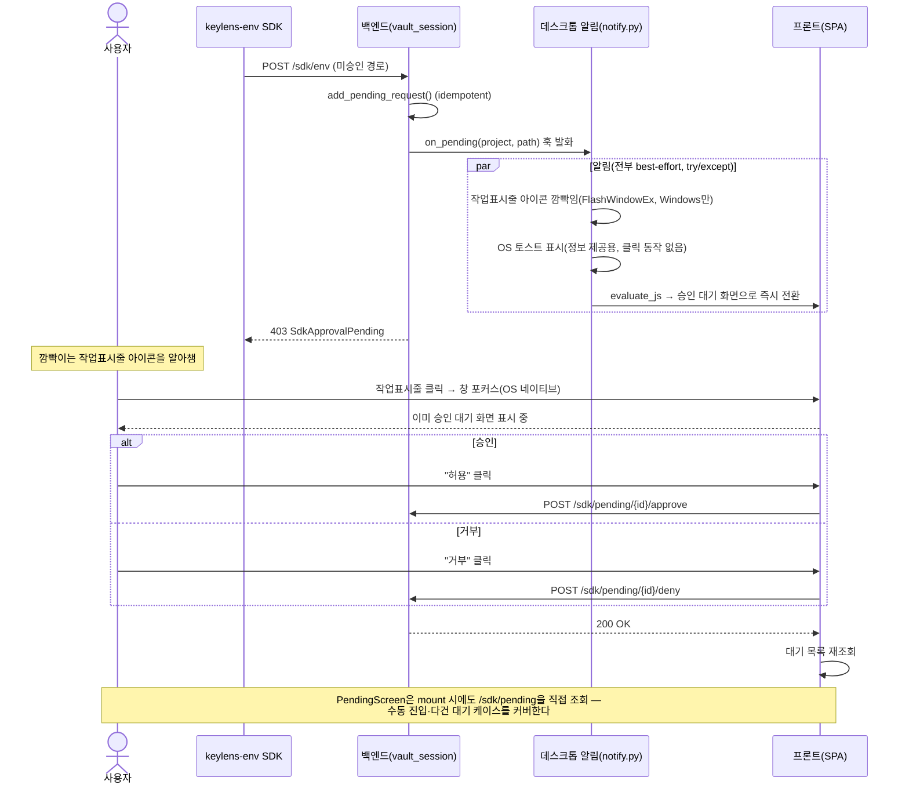

<!--
SPDX-FileCopyrightText: 2026 [Your Name]
SPDX-License-Identifier: MIT
-->

# RUNTIME-1 — 데스크톱 승인 알림 + 최소 승인 대기 화면 설계

> BACKLOG의 RUNTIME-1 남은 서브플랜 중 "승인 요청 알림(데스크톱 토스트)"을 구현한다.
> 진행 중 발견: 승인 대기 화면이 아직 프론트에 전혀 없어 이번 스코프에 최소 버전으로 포함한다.

## 배경

`keylens-env` SDK가 미등록 디렉토리에서 값을 요청하면 백엔드(`vault_session.py`)가
`sdk_repo.add_pending_request()`로 대기열에 등록하고 `SdkApprovalPending`을 던진다.
지금은 이 대기 요청을 사용자가 알아챌 방법이 전혀 없다(폴링 UI도 알림도 없음).
이번 작업은 (1) 데스크톱 앱에서 이 순간 알아채게 하는 알림과 (2) 그 요청을 실제로
승인/거부할 최소 화면을 만든다.

## 아키텍처

세 계층이 얽힌다.

1. **백엔드**(`vault_session.py`) — `VaultService`에 `on_pending` 훅 추가. 기본은 no-op.
   `sdk_env()`가 `add_pending_request()` 직후 이 훅을 호출한다.
2. **데스크톱 레이어**(`desktop/notify.py` 신설) — 실제 알림 로직(토스트·작업표시줄 깜빡임·
   화면 전환). `desktop/app.py`가 기동 시 `VAULT.set_pending_hook(...)`으로 주입한다.
3. **프론트엔드** — 새 `pending` 뷰(승인 대기 목록 + 승인/거부 버튼) + 데스크톱이 창을
   그 화면으로 바로 전환시키는 연결.

### 핵심 설계 판단 — 토스트 클릭 콜백에 의존하지 않는다

Windows에서 plyer/win10toast의 클릭 콜백은 exe로 패키징했을 때 신뢰성이 낮다(cx_Freeze
빌드에서 흔히 깨지는 유형). 대신 새 요청이 들어오는 즉시(클릭 여부와 무관하게) 이미 떠
있는 SPA를 승인 대기 화면으로 미리 전환해 둔다 — 사용자가 깜빡이는 작업표시줄 아이콘을
클릭(OS 네이티브 동작이라 항상 신뢰 가능)하면 이미 그 화면이 보인다.

## 사용자 액션 다이어그램 (User Action Flow)

## 구성 요소

| 파일 | 변경 |
|---|---|
| `backend/app/vault_session.py` | `VaultService.__init__`에 `on_pending` 콜백 파라미터(기본 no-op) + `set_pending_hook()` 메서드. `sdk_env()`가 `add_pending_request()` 직후 훅 호출 |
| `desktop/notify.py` (신설) | `plyer.notification.notify`(토스트) + `ctypes`로 `FlashWindowEx`(작업표시줄 깜빡임, Windows 전용 가드) + `webview.evaluate_js(...)`로 SPA를 승인 대기 화면으로 전환. 전부 try/except로 감싸 실패해도 SDK 요청 흐름에 영향 없음 |
| `desktop/app.py` | 창 생성 후 `VAULT.set_pending_hook(build_notifier(...))` 연결 |
| `frontend/src/store/keylensStore.ts` | `View`에 `'pending'` 추가, `goPending()` 액션 |
| `frontend/src/components/screens/PendingScreen.tsx` (신설) | 대기 목록(프로젝트·경로·요청시각) + 승인/거부 버튼, 빈 상태 문구 |
| `frontend/src/components/Sidebar.tsx` | 승인 대기 메뉴 항목 추가(대기 건수 있으면 뱃지) |
| `frontend/src/api/client.ts` | `sdkApi.pending()/approve()/deny()` 추가 |
| `App.tsx` | `window.__keylensGoPending` 전역 함수 등록(데스크톱이 `evaluate_js`로 호출할 진입점) |

## 데이터 흐름

1. SDK가 미승인 경로에서 `/sdk/env` 호출 → `sdk_env()`가 `add_pending_request()`(idempotent) 후 `on_pending(project, path)` 발화
2. 데스크톱 훅: 작업표시줄 아이콘 깜빡임 + OS 토스트(정보 제공용, 클릭 동작 없음) + `evaluate_js`로 SPA를 승인 대기 화면으로 즉시 전환
3. 사용자가 깜빡이는 아이콘 클릭(OS 네이티브 포커스) → 이미 승인 대기 화면
4. `PendingScreen`은 mount 시에도 `/sdk/pending`을 직접 조회(수동 진입·다건 대기 케이스 커버)
5. 승인/거부 → API 호출 → 목록 재조회
6. dev/테스트 모드(`main.py` 단독 임포트)는 훅이 기본 no-op — 동작·pytest 영향 0

## 에러 처리

- 알림 모듈 전체가 try/except로 감싸져, 토스트·플래시·evaluate_js 중 무엇이 실패해도 SDK 요청 자체는 정상 진행(사용자는 최소한 화면 안 배너로 뒤늦게라도 확인 가능)
- `FlashWindowEx`는 `sys.platform == 'win32'` 가드 + 창 핸들 못 찾으면 조용히 스킵
- 승인/거부 API 실패 → 기존 `showToast`로 안내

## 테스트

- 백엔드: `set_pending_hook` — 새 경로엔 정확히 1회 호출(중복 요청 idempotent 재호출 안 됨), 인자(project, path) 검증, 기본 no-op이 기존 sdk 테스트를 안 깨는지
- `desktop/notify.py`: 플랫폼 가드·예외 흡수 로직만 유닛테스트(OS 토스트 자체는 수동 검증 대상)
- 프론트: `PendingScreen` 목록 렌더링 + 승인/거부 후 재조회, `goPending` 스토어 액션
- 수동 검증: 데스크톱 exe 기동 → 미등록 디렉토리에서 SDK 요청 → 깜빡임·토스트 확인 → 클릭 시 대기 화면 확인

## 범위 밖

- macOS(dock 바운스)·Linux(urgency hint) — Windows 우선, 후속 확장
- 토스트 클릭 콜백 — 자동 전환 방식으로 대체(위 "핵심 설계 판단" 참고)
- 신규 의존성 `plyer`(MIT) — 실제 추가 전 license-auditor로 먼저 심사
- 프론트 "디렉토리 등록" 설정 화면 — 별도 서브플랜(이번엔 승인 대기 목록만)
