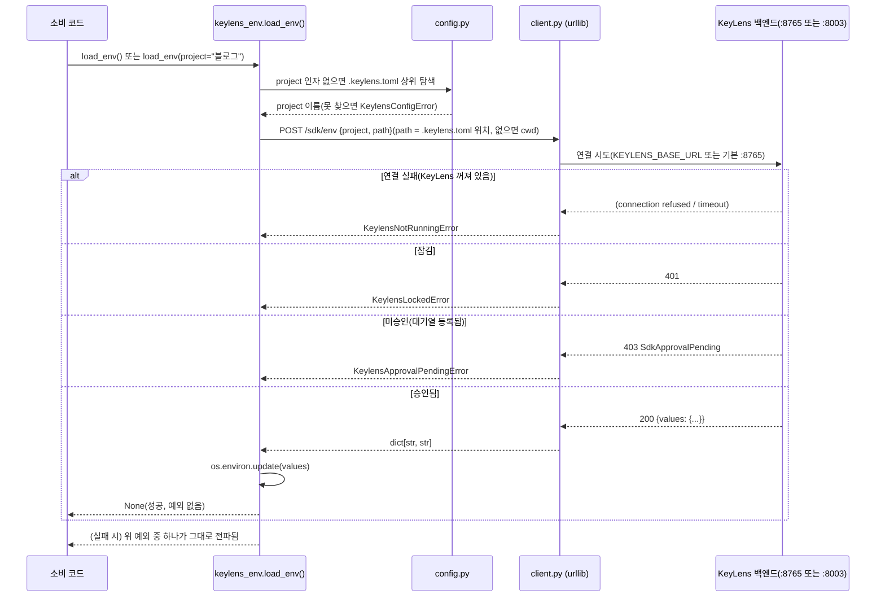

<!--
SPDX-FileCopyrightText: 2026 [Your Name]
SPDX-License-Identifier: MIT
-->

# `keylens-env` 패키지 + 프론트 프로젝트 접근 설정 화면 설계

> RUNTIME-1의 남은 두 서브플랜(`keylens-env` 패키지 자체, 프론트 "디렉토리 사전등록" 설정 화면)을 다룬다.
> 백엔드 기반(`/sdk/*` API 전체)과 데스크톱 승인 알림은 이미 완료돼 있다 — 이 설계는 그 위에
> **실제로 코드에서 `import`해서 쓰는 SDK 클라이언트 패키지**와, 승인 팝업 없이도 미리 디렉토리를
> 등록해 둘 수 있는 프론트 화면을 얹는다.

## 배경

지금은 `.env` 내보내기(CORE-5)로 평문 파일을 만들어 쓴다 — 결국 디스크에 평문이 남는 건 똑같다.
`keylens-env`는 `python-dotenv`처럼 코드에서 한 줄로 값을 불러오되, 실제로는 **실행 중이고 잠금
해제된 KeyLens 로컬 백엔드**에서 그때그때 값을 받아 `os.environ`에 주입한다 — 디스크에 평문 `.env`
파일이 남지 않는다.

백엔드 쪽(프로젝트별 허용 디렉토리, 승인 대기열, `entries_for_env` 값 병합, `/sdk/*` 8개 엔드포인트)과
데스크톱 알림(작업표시줄 깜빡임·토스트·`PendingScreen` 자동 전환)은 이미 구현·머지되어 있다. 하지만
그걸 실제로 불러 쓸 **클라이언트 코드가 레포에 없다** — `pip install keylens-env` 하고
`import keylens_env`할 그 패키지 자체가 아직 없다. 이 설계는 그 공백을 메운다.

또한 백엔드는 `/sdk/projects`·`/sdk/projects/{project}/directories`(GET/POST/DELETE) API를 이미
갖고 있지만, 프론트에는 이걸 쓰는 화면이 없다 — 지금은 미등록 디렉토리가 최초 요청했을 때 뜨는
승인 팝업(`PendingScreen`)으로만 디렉토리가 등록된다. 이번에 "미리 등록해 두는" 설정 화면도 함께 만든다.

## 스코프

- ✅ **포함**: `keylens-env` Python 패키지(레포 안, 로컬 설치까지) + 프론트 "프로젝트 접근" 설정 화면
- ❌ **범위 밖**: 실제 PyPI 업로드(twine, 계정·토큰 필요 — 사용자가 나중에 직접 진행), Node.js/npm 버전,
  브라우저 탭 알림 채널(`Notification` Web API — 별도 항목), SYNC-2(계정 로그인 동기화, 완전히 다른 기능)

## 아키텍처

세 부분이 새로 생긴다.

1. **`keylens-env` 패키지**(레포 루트, `keylens-env/`) — `backend/`나 `frontend/`와 같은 레벨의 독립
   Python 패키지. **백엔드 코드를 import하지 않는다** — 순수 HTTP 클라이언트로, 실행 중인 KeyLens의
   `/sdk/env`만 호출한다. 새 런타임 의존성 0(표준 라이브러리 `urllib.request` + `tomllib`만 사용).
2. **`config.py`** — 소비 레포 루트의 `.keylens.toml`(`project = "블로그"`)을 `python-dotenv`의
   `find_dotenv()`와 같은 방식(cwd → 상위 디렉토리로 탐색, 파일시스템 루트에서 중단)으로 찾는다.
3. **프론트 `ProjectAccessScreen`** — 기존 `sdkApi`(승인 대기 전용)를 프로젝트/디렉토리 CRUD로 확장해
   백엔드가 이미 제공하는 `/sdk/projects*` API에 연결한다.

### 핵심 설계 판단 — 즉시 실패(fail-fast), 폴링 없음

`load_env()`가 승인 대기(403) 상태를 만나면 **즉시 예외를 던지고 끝낸다** — 승인될 때까지 재시도하며
기다리지 않는다. 스크립트/CI가 이유 없이 멈춰 있는 것처럼 보이는 걸 피하고, `python-dotenv`와 동일한
동기·예측 가능한 호출 모델을 유지하기 위함. 사용자는 KeyLens에서 승인한 뒤 스크립트를 다시 실행한다.
(대안으로 폴링·콜백 방식도 검토했으나, v1에는 불필요한 복잡도라 채택하지 않음 — "브레인스토밍" 단계에서
사용자와 함께 확정.)

## 시퀀스 다이어그램 — `load_env()` 호출



## 구성 요소

| 파일 | 역할 |
|---|---|
| `keylens-env/pyproject.toml` | 패키지 메타데이터, `hatchling` 빌드 백엔드(MIT), Python ≥3.11 |
| `keylens-env/README.md` | 사용법(설치, `.keylens.toml` 작성법, 예외 처리 예시) — `python-dotenv` README 스타일 |
| `keylens-env/src/keylens_env/__init__.py` | 공개 API: `load_env()`, 예외 재노출 |
| `keylens-env/src/keylens_env/exceptions.py` | `KeylensEnvError`(베이스) → `KeylensNotRunningError`, `KeylensLockedError`, `KeylensApprovalPendingError`, `KeylensConfigError` |
| `keylens-env/src/keylens_env/config.py` | `.keylens.toml` 상위 탐색 + `tomllib` 파싱 → `project: str` |
| `keylens-env/src/keylens_env/client.py` | `urllib.request`로 `POST /sdk/env` 호출, HTTP 상태 → 예외 매핑 |
| `keylens-env/tests/test_config.py` | 상위 탐색 로직 단위테스트(임시 디렉토리 트리) |
| `keylens-env/tests/test_client.py` | `http.server`로 가짜 KeyLens 서버(200/401/403/미기동) 흉내, 예외 매핑 검증 |
| `keylens-env/tests/test_load_env_integration.py` | 실제 `backend.app.main:app`을 uvicorn으로 기동해 end-to-end 검증(1개) |
| `frontend/src/api/client.ts` | `sdkApi`에 `projects()/dirs(project)/addDir(project, path)/removeDir(project, id)` 추가 |
| `frontend/src/store/keylensStore.ts` | 프로젝트 접근 화면용 상태·액션(목록 로딩, 추가, 삭제) |
| `frontend/src/components/screens/ProjectAccessScreen.tsx`(신규) | 프로젝트별 허용 디렉토리 목록 + 추가/삭제 UI |
| `frontend/src/components/Sidebar.tsx` | 4번째 메뉴 "프로젝트 접근" 추가 |
| `frontend/src/App.tsx` | `View`에 `'projectAccess'` 추가, 라우팅 |

## 공개 API

```python
import keylens_env

keylens_env.load_env()                    # .keylens.toml에서 project 자동 탐색
keylens_env.load_env(project="블로그")      # .keylens.toml 없이 명시 오버라이드
```

- 성공 시 `os.environ`에 값을 주입하고 `None`을 반환한다(반환값 없음 — 부수효과가 전부).
- 실패 시 아래 넷 중 하나를 던진다(전부 `KeylensEnvError` 상속, `except KeylensEnvError`로 한 번에 잡을 수도 있음):
  - `KeylensNotRunningError` — "KeyLens를 켜 주세요"
  - `KeylensLockedError` — "KeyLens 잠금을 해제해 주세요"
  - `KeylensApprovalPendingError` — "KeyLens에서 이 디렉토리의 접근 요청을 승인해 주세요"
  - `KeylensConfigError` — `.keylens.toml`을 못 찾았고 `project` 인자도 없음

## 데이터 흐름 / 설정 탐색

- `project` 인자가 있으면 `.keylens.toml` 탐색을 건너뛴다.
- 없으면 `Path.cwd()`에서 시작해 `.keylens.toml`이 나올 때까지 부모 디렉토리로 올라간다(파일시스템
  루트에 닿으면 중단). 찾은 파일을 `tomllib.load()`로 파싱해 `project` 키를 읽는다. 파일은 있는데
  `project` 키가 없거나 둘 다 없으면 `KeylensConfigError`.
- 접속 주소: 기본 `http://127.0.0.1:8765`(데스크톱 exe 기본 포트) → 실패 시 재시도하지 않고 그대로
  `KeylensNotRunningError`(자동 폴백으로 다른 포트를 조용히 시도하면 "어디에 붙었는지" 불투명해지므로
  하지 않는다). 환경변수 `KEYLENS_BASE_URL`이 있으면 그 값을 그대로 쓴다(개발 모드 `:8003` 등).
- `path` 파라미터(백엔드 `/sdk/env`가 받는 두 번째 필드)는 `.keylens.toml`이 위치한 디렉토리의
  절대경로를 보낸다(탐색 시작점인 `cwd`가 아니라 — 프로젝트 루트가 승인 단위이므로).
- `project` 인자를 명시해 `.keylens.toml` 탐색 자체를 건너뛴 경우(파일이 아예 없어도 되는 경로)에는
  기준으로 삼을 프로젝트 루트가 없으므로 `path`는 `Path.cwd()`를 그대로 보낸다.

## 에러 처리

- 네트워크 예외(`URLError`, `ConnectionRefusedError`, timeout)는 전부 `KeylensNotRunningError`로 정규화.
- HTTP 상태 코드 → 예외 매핑은 `client.py` 한 곳에서만 한다(백엔드가 상태 코드를 바꾸면 여기만 고치면 됨).
- 조용한 실패·빈 값 반환은 절대 없다 — 이게 이 패키지 존재 이유(BACKLOG 원칙 그대로).
- 프론트 `ProjectAccessScreen`은 기존 관례(`vaultErrorText`, `showToast`, `VaultApiError` 401 처리)를
  그대로 재사용한다 — 새 에러 처리 패턴을 만들지 않는다.

## 테스트

- **`test_config.py`**: `tmp_path`로 디렉토리 트리를 만들어 상위 탐색(찾음/못 찾음/여러 단계 위) 검증.
  네트워크·서버 불필요.
- **`test_client.py`**: 표준 라이브러리 `http.server.HTTPServer`를 백그라운드 스레드로 띄우고, 요청마다
  200/401/403을 흉내 내는 핸들러로 `client.py`의 예외 매핑을 검증. 서버를 안 띄운 케이스(포트 미기동)로
  `KeylensNotRunningError`도 검증. 새 테스트 의존성 0.
- **`test_load_env_integration.py`**: `backend.app.main:app`을 실제 uvicorn으로 스레드 기동(패턴은
  `desktop/app.py`의 `_wait_ready()`와 동일) → 금고 초기화·잠금해제·항목 저장 후 `load_env()`가 실제
  값을 받아오는지 end-to-end로 1개만 검증. 이 테스트 파일만 `backend/` 의존성(fastapi 등)이 설치돼
  있어야 하며, 이는 **패키지 자체의 런타임 의존성이 아니라 이 레포 안에서 도는 테스트 전용 요구사항**이다
  (`pyproject.toml`의 `[project.optional-dependencies].test`에만 backend 경로를 넣거나, CI에서만
  `backend/requirements.txt`를 함께 설치).
- **프론트**: 기존 프로젝트 관례상 React 컴포넌트/스토어 자동테스트 인프라가 없으므로(데스크톱 알림
  플랜과 동일 판단), `ProjectAccessScreen`은 `tsc --noEmit`/`lint`/`build`로 검증하고 브라우저 수동
  확인으로 마무리한다.

## 범위 밖 (이번 설계에 안 넣음)

- 실제 PyPI 업로드(계정·API 토큰 필요 — 사용자가 별도 진행)
- Node.js/npm 버전의 `keylens-env`
- 브라우저 탭(`npm run dev`) 알림 채널 — 이미 별도 백로그 항목
- 폴링·콜백 기반 "승인될 때까지 대기" 모드
- macOS/Linux 알림(데스크톱 알림 플랜과 동일하게 범위 밖)
- SYNC-2(계정 로그인 기반 서버 동기화) — 완전히 다른 기능, 별도 설계 필요
