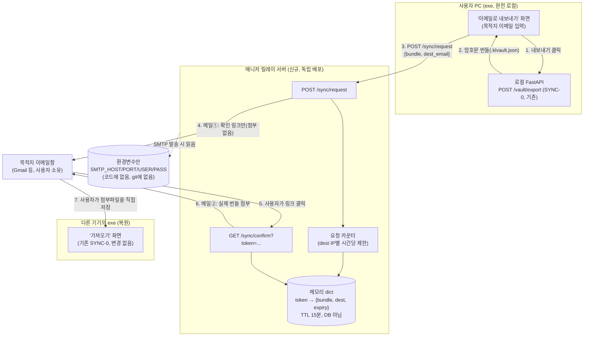
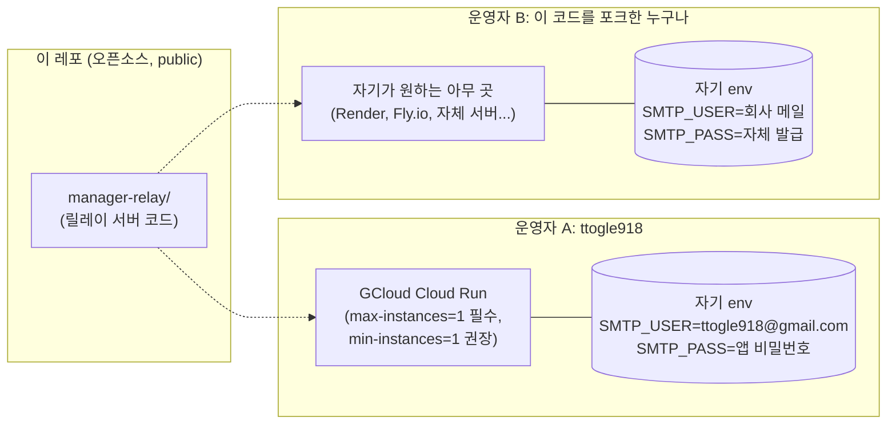
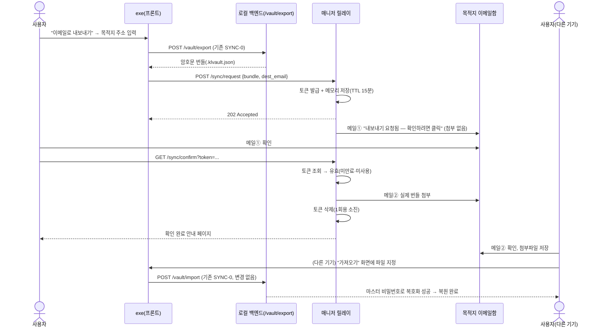
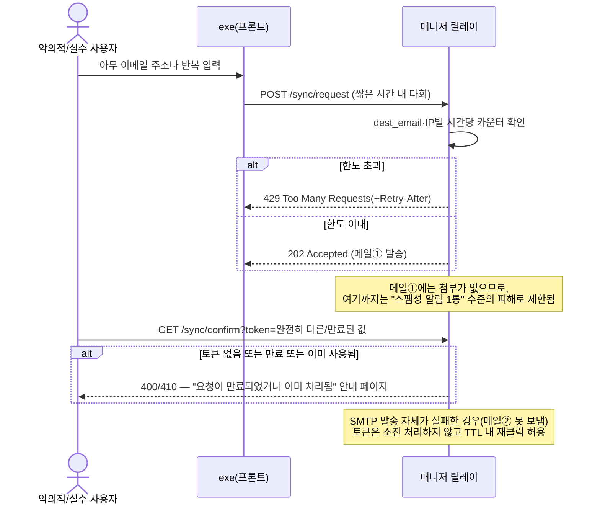
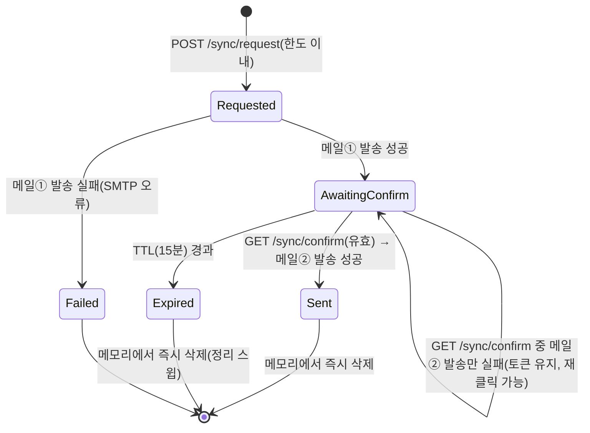

<!--
SPDX-FileCopyrightText: 2026 [Your Name]
SPDX-License-Identifier: MIT
-->

# SYNC-2 재설계 — 계정·클라우드 DB 없는 이메일 릴레이 동기화

> `docs/memo/2026-07-30-sync2-server-sync-decisions.md`(Supabase 계정 로그인 기반 설계)를 **대체**한다.
> `feature/sync2-supabase` 브랜치에 이미 구현된 Supabase 로그인·업로드/다운로드 코드는 이 설계로
> 완전히 교체되며, 해당 브랜치는 머지하지 않고 참고용으로만 남긴다. 이 문서는 `feature/sync2-email-relay`
> 브랜치에서 착수하는 새 설계다.

## 배경

Supabase 계정 로그인 기반 SYNC-2를 실사용 검증하던 중 두 가지 문제가 드러났다.

1. **이메일 발송 한도**: Supabase 기본 메일러는 가입 확인 메일을 **프로젝트 전체 합산 시간당 2통**으로
   제한한다(사용자별이 아니다). 강의 현장처럼 30명이 비슷한 시간대에 가입을 시도하는 시나리오에서
   3번째 요청부터 즉시 막힌다.
2. **오픈소스 대회 정합성 우려**: 이 프로젝트는 "로컬 우선·외부 서버 없음"을 핵심 차별점으로 내세우는데,
   Supabase Postgres에 사용자 데이터(암호문이라도)가 쌓이는 구조는 "결국 우리가 클라우드 DB를 운영한다"는
   인상을 준다. 대회 심사에서 이 인상이 불리하게 작용할 수 있다는 우려가 나왔다.

이 두 문제를 논의하면서 나온 대안이 이 문서의 설계다: **계정도, DB도 없이 — 이메일을 전송 매체로만
쓰는 릴레이 서버**로 멀티 기기 백업을 해결한다.

## 스코프

- ✅ **포함**: 목적지 이메일 입력 → 확인 링크 클릭 → 암호화 번들 첨부 메일 발송(2단계 발송) 흐름 전체,
  이를 처리하는 독립 배포형 "매니저 릴레이" 서비스, 프론트엔드의 계정 UI를 이메일 입력 UI로 교체
- ❌ **범위 밖**: 자동 복원(첨부파일을 받은 뒤 가져오기는 여전히 사용자가 수동으로 함 — 기존 SYNC-0
  가져오기 화면 그대로 재사용), 매니저 릴레이의 영구 저장소(의도적으로 두지 않음), Supabase 코드 정리
  (이 설계 승인 후 별도 커밋에서 제거), 실배포 인프라 자동화(Terraform 등)

## 핵심 설계 판단

### 판단 1 — 계정도 DB도 없다: "매니저"가 쥔 건 SMTP 자격증명뿐

로그인·회원가입 개념 자체를 없앤다. 대신 이메일 발송이라는 행위 자체를 대행해주는 **매니저 릴레이
서버**를 둔다. 매니저는 SMTP 자격증명(호스트/포트/계정/비밀번호)을 자기 서버의 환경변수로만 갖고 있고,
사용자의 번들이나 이메일 주소를 자체 저장소에 저장하지 않는다 — 릴레이 *프로세스*는 요청이 끝나면
메모리에서 아무것도 남기지 않는다. 다만 이는 릴레이 프로세스/토큰 저장소에 한정된 이야기다 —
`smtp.gmail.com` 등 대부분의 SMTP 제공자는 발송 계정의 "보낸 편지함"에 매 발송분의 사본을 영구
보관하므로, 매니저의 메일 계정 자체는 모든 릴레이 이력(메타데이터 포함)이 쌓이는 아카이브가 된다.

**왜 SMTP인가(Gmail API 대신)**: Gmail API(OAuth)는 매니저가 반드시 Gmail 계정이어야 하고, 토큰
갱신 로직까지 직접 구현해야 한다. 범용 SMTP는 Python 표준 라이브러리(`smtplib`)만으로 되고, Gmail
앱 비밀번호부터 Resend/SendGrid의 SMTP 엔드포인트까지 **env 값만 바꾸면 그대로 교체**된다. 이 프로젝트는
"누구나 자기 자격증명으로 자기 매니저를 운영할 수 있어야 한다"는 오픈소스 지향과 SMTP가 더 잘 맞는다.

### 판단 2 — 2단계 발송(확인 링크 → 실제 첨부)으로 릴레이 어뷰징 방지

매니저 릴레이는 원리상 "임의의 이메일 주소로 메일을 보내는 창구"가 된다. 첫 요청에서 바로 첨부파일을
보내면, 누구든 exe로 아무 이메일 주소나 입력해 스팸을 발생시킬 수 있다. 그래서 발송을 두 단계로 쪼갠다.

1. 목적지 주소로 **확인 메일**(첨부 없음, 클릭 링크만)을 보낸다.
2. 그 링크를 **그 이메일함의 주인만** 클릭할 수 있으므로, 클릭이 들어와야 비로소 **실제 첨부 메일**을
   보낸다.

이렇게 하면 "요청자가 실제로 그 이메일함에 접근 가능한지"를 계정 없이도 확인할 수 있고, 릴레이가
공개 스팸 발송기로 악용될 여지를 줄인다.

### 판단 3 — 토큰·번들은 메모리에만, 확정 TTL로 만료

확인 링크를 클릭하기 전까지 번들을 잠깐 들고 있어야 하는데, 이를 위해 새 DB를 두면 애초에 피하려던
문제(영구 저장소 운영)가 재발한다. 대신 **서버 프로세스 메모리의 dict + TTL(기본 15분)**로 처리한다.
매니저 서버가 그 사이 재시작되면(예: 무료 티어 서버리스가 인스턴스를 회수) 대기 중이던 요청은 유실될
수 있다 — 이 경우 사용자는 그냥 "이메일로 내보내기"를 다시 누르면 된다. 재시도 비용이 낮으므로, DB를
새로 두는 것보다 이 트레이드오프를 택한다.

### 판단 4 — 복원은 여전히 100% 로컬, 새 복호화 경로를 만들지 않는다

애초에 "복호화를 exe나 랜딩페이지에서만 되게 하자"는 아이디어가 있었지만, 검토 결과 **새 복호화
경로 자체가 필요 없다는 결론**을 냈다. 복원은 지금도 항상 exe 로컬에서만 일어난다(SYNC-0 가져오기,
`/vault/import`). 이 설계는 "번들을 어떻게 다른 기기로 옮기느냐"만 자동화(이메일 발송)할 뿐, 그 번들을
여는 방법은 하나도 바꾸지 않는다. 그래서 랜딩페이지(GitHub Pages, 정적 사이트)는 지금처럼 아무 것도
안 만지는 안전한 상태 그대로 남는다 — RESULT_REPORT §8.5의 "랜딩페이지는 사용자 키를 안 만져서
안전하다"는 근거가 그대로 유지된다.

## 아키텍처 개요



핵심: 매니저 릴레이는 **비밀 값을 절대 보지 않지만**(번들의 값 필드는 암호문), 번들에는
`service`/`label`/`project`/`memo` 같은 **메타데이터가 평문으로 포함**되어 있어 이를 중계하는
매니저와 그의 메일 제공자는 "이 사용자가 어떤 서비스의 자격증명을 갖고 있는지"는 볼 수 있다.
릴레이 프로세스 자신은 요청 처리 후 메모리에서 아무것도 영구 저장하지 않는다(다만 SMTP 발송의
특성상 매니저의 메일함에는 남을 수 있다 — 판단 1 참고). 로그인·계정·RLS 개념 자체가 없다.

## 배포 형태 — 셀프호스트 가능한 별도 서비스



`manager-relay/`는 코드 저장소에는 있지만 **실행 서버가 아니다** — 각 운영자가 자기 SMTP 자격증명으로
직접 배포해야 동작한다. 이 코드에는 어떤 실제 자격증명도 커밋되지 않는다(`.env.example`만 커밋).
이 프로젝트의 실제 제출/시연에는 ttogle918이 운영자로서 GCloud Cloud Run에 배포한다. 이 서비스는
**`--max-instances=1`이 필수**다(권장이 아니라 필수) — 토큰 저장소가 인스턴스 프로세스 메모리에만
있어 공유되지 않으므로, 인스턴스가 2개 이상으로 늘어나면 `POST /sync/request`와 `GET /sync/confirm`이
서로 다른 인스턴스로 라우팅되어 멀쩡한 요청도 410로 실패할 수 있다. `min-instances=1`은 스케일-투-제로로
인한 대기 요청 유실을 줄여주지만 이 문제는 막지 못하므로 별개로 함께 설정한다.

## 시퀀스 다이어그램 — 정상 흐름 (백업 → 확인 → 복원)



## 시퀀스 다이어그램 — 실패·어뷰징 방지 경로



## 상태 다이어그램 — 릴레이 요청(토큰)의 생명주기



## 구성 요소

| 파일/경로 | 역할 |
|---|---|
| `manager-relay/pyproject.toml` | 독립 배포 서비스 메타데이터. 새 런타임 의존성 0(표준 라이브러리 `smtplib`/`email`, 웹 프레임워크는 기존 `fastapi`/`uvicorn` 재사용) |
| `manager-relay/app/main.py` | `POST /sync/request`, `GET /sync/confirm` 두 엔드포인트 |
| `manager-relay/app/token_store.py` | 메모리 dict + TTL 관리(발급/조회/소진/만료 스윕) |
| `manager-relay/app/rate_limit.py` | dest_email·IP별 시간당 카운터(메모리, 고정 윈도우). 기본값 dest_email당 시간당 3회, IP당 시간당 10회 — 각각 `RELAY_RATE_LIMIT_PER_EMAIL`/`RELAY_RATE_LIMIT_PER_IP` env로 운영자가 조정 가능(기존 `KEYLENS_AUTOLOCK_SECONDS` 류 관례와 동일하게 미설정 시 기본값 사용) |
| `manager-relay/app/mailer.py` | `smtplib`로 메일① / 메일② 발송, env에서 SMTP 설정 읽기 |
| `manager-relay/.env.example` | `SMTP_HOST`/`SMTP_PORT`/`SMTP_USER`/`SMTP_PASS`/`PUBLIC_BASE_URL`(확인 링크에 쓸 자기 배포 주소) — 실제 값은 각 운영자의 배포 환경변수에만 |
| `manager-relay/tests/test_token_store.py` | 발급→조회→소진, 만료 스윕 단위테스트 |
| `manager-relay/tests/test_rate_limit.py` | 한도 초과 시 429 검증 |
| `manager-relay/tests/test_mailer.py` | `smtplib.SMTP`를 monkeypatch해 실제 네트워크 없이 발송 호출 인자 검증 |
| `frontend/src/components/modals/Modals.tsx` | 기존 `AccountSyncModal`(로그인 UI)을 이메일 입력 UI로 교체 |
| `frontend/src/store/keylensStore.ts` | Supabase 로그인/업로드/다운로드 액션 제거, `requestEmailExport(destEmail)` 액션으로 교체 |
| `frontend/src/lib/supabase.ts` | **삭제** — 이 설계에서 대체됨 |
| `package.json`(frontend) | `@supabase/supabase-js` 의존성 제거 |

## API

### `POST /sync/request`

```json
// 요청
{ "destination_email": "user@example.com", "bundle": { /* .klvault.json 그대로 */ } }
```

- 성공: `202 Accepted` (메일① 발송을 시도했다는 의미, 실제 성공 여부는 이메일함에서 확인)
- 한도 초과: `429 Too Many Requests` + `Retry-After` 헤더
- 번들 형식 이상(`bundle.format`이 SYNC-0의 `keylens-vault`가 아님): `422`
- 본문이 과도하게 큼(1MB 초과): `413`(Content-Length 헤더만 보고 파싱 전에 거부)

### `GET /sync/confirm?token=...`

- 유효한 토큰: 메일② 발송 후 `200`(간단한 안내 HTML: "요청하신 파일을 이메일로 보냈습니다")
- 존재하지 않음/만료/이미 사용됨: `410 Gone`(안내 HTML)
- 메일② 발송 자체가 실패(SMTP 오류): `502`(토큰은 소진하지 않음 — TTL 내 재시도 가능)

## 에러 처리

- 네트워크·SMTP 예외는 `mailer.py` 한 곳에서만 잡아 상위에 도메인 예외로 정규화한다(기존
  `keylens-env`의 "예외 매핑은 client.py 한 곳에서" 관례를 그대로 따름).
- 조용한 실패 없음: 메일①/② 중 하나라도 발송에 실패하면 반드시 HTTP 에러 코드로 드러낸다.
- 한도 초과(429)와 토큰 만료(410)는 사용자에게 "다시 시도하면 되는 상황"임을 명확히 안내하는 문구를
  포함한다 — 이 프로젝트의 "사용자 친화적 에러 메시지" 관례(BACKLOG 진행 현황 참고)를 따른다.

## 테스트

- **`test_token_store.py`**: 발급 → 조회 → 소진(재조회 시 없음) → TTL 경과 후 자동 만료, 전부 네트워크
  불필요(시간은 주입 가능한 clock으로 제어).
- **`test_rate_limit.py`**: 동일 dest_email/IP로 한도 초과 요청 시 429, 윈도우 경과 후 다시 허용됨.
- **`test_mailer.py`**: `smtplib.SMTP`를 monkeypatch하여 실제 메일 발송 없이 "이 인자로 호출됐다"만 검증
  (`keylens-env`의 `test_client.py`가 `http.server`로 가짜 서버를 흉내낸 것과 같은 정신 — 여기선 실제
  네트워크 대신 mock으로 대체, SMTP 프로토콜을 흉내 내는 가짜 서버까지는 과함).
- **수동 검증(자동화 범위 밖)**: 실제 SMTP 자격증명으로 ttogle918@gmail.com까지 왕복 — 확인 메일 수신 →
  클릭 → 첨부 메일 수신 → 다른 기기(또는 시크릿 창)에서 가져오기 성공까지. CI에는 실제 자격증명을
  두지 않으므로 이 마지막 단계는 항상 사람이 수행한다.

## 범위 밖(이번 설계에 안 넣음)

- 매니저 릴레이의 영구 저장소(의도적 설계 — "재시도하면 되는" 트레이드오프를 택함)
- 여러 매니저 간 페더레이션·검색(어느 매니저에 내 데이터가 있는지 찾아주는 기능 — 애초에 저장을 안 하므로 개념 자체가 없음)
- Gmail API/OAuth 경로(코드 복잡도·Gmail 종속 문제로 SMTP 단일화)
- Supabase 코드 제거 자체(이 스펙 승인 후 별도 커밋/PR에서 진행 — 이 문서는 새 기능 설계에 집중)
- `docs/BACKLOG.md`의 SYNC-2 항목·`docs/memo/2026-07-30-sync2-server-sync-decisions.md` 갱신(스펙
  승인 후 구현 계획 단계에서 함께 반영)
