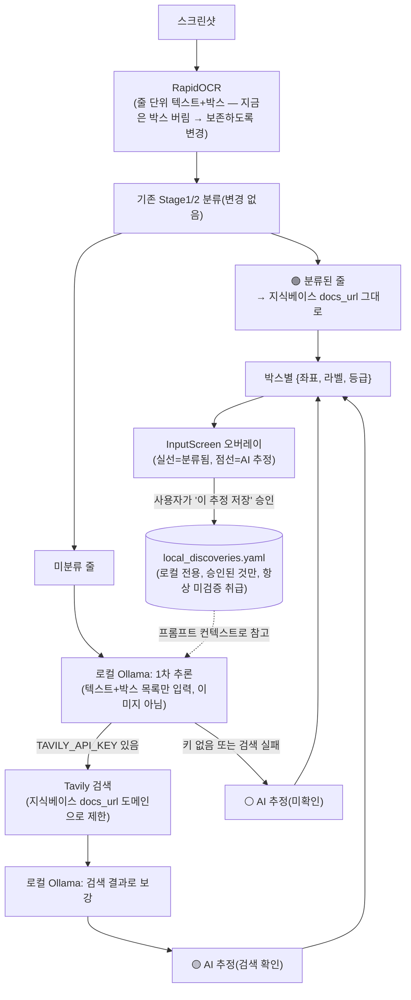
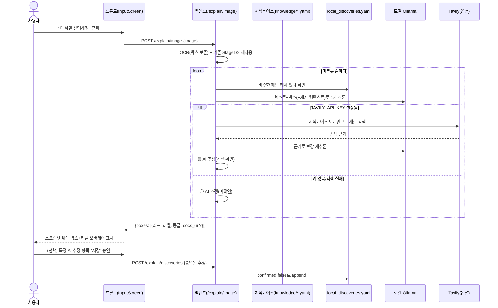

<!--
SPDX-FileCopyrightText: 2026 [Your Name]
SPDX-License-Identifier: MIT
-->

# 화면 영역별 AI 설명 기능 설계 (스크린샷 위 박스 + 라벨)

> 스크린샷을 업로드했을 때, 값 하나만 분류하는 게 아니라 **화면 전체에서 각 영역이 뭘 의미하는지**
> 박스로 짚어가며 설명하는 기능("이 화면 설명해줘"). 로컬 우선 원칙(Ollama 로컬 LLM)과 오탐 방지
> (신뢰 등급 뱃지)를 최우선으로 설계했다. 백로그 배치는 착수 시 결정(GUIDE-1/2와 같은 계열의
> "GUIDE-3" 후보로 제안).

## 배경

기존 Stage1/2 분류는 정규식·키워드 규칙으로 값 하나하나를 서비스/종류로 매핑하지만, "이 화면 자체가
뭔지", "이 URL의 이 부분이 왜 이 의미인지"는 설명하지 않는다. 새로운 서비스를 처음 만난 사용자는
화면의 어떤 버튼을 눌러야 뭐가 나오는지, URL의 어느 구간이 무슨 ID인지 스스로 알아내야 한다.

이 기능을 논의하면서 두 가지 제약이 자연스럽게 정해졌다.

1. **생성형 AI 사용 자체가 문제는 아니다** — 이 프로젝트엔 이미 `docs/AI_MODEL_DISCLOSURE.md`
   ("AI 모델 활용 명세서", 운영규정 9조)라는 공식 신고 체계가 있고, Tesseract OCR도 이미 "외부
   사전학습 모델 그대로 활용(파인튜닝 없음), 실행 위치: 사용자 브라우저 안(로컬)"으로 신고돼 있다.
   이 기존 신고의 "로컬 실행 = 프라이버시 유지" 패턴을 그대로 이어받는 게 핵심 제약이다.
2. **스크린샷엔 진짜 비밀 값이 찍혀 있을 수 있다** — 클라우드 LLM API나 일반 웹 검색 API에
   이미지·텍스트를 통째로 보내면, 이 프로젝트가 막으려는 바로 그 유출이 된다. 그래서 로컬 LLM
   (Ollama 등, 사용자가 이미 띄워둔 것에 옵트인으로 연결 — 앱이 모델을 번들하지 않음)을 기본으로
   하고, 외부 검색이 필요한 경우도 전체 웹이 아니라 이미 알려진 서비스의 공식 문서 도메인으로
   제한한다.

## 스코프

- ✅ **포함**: OCR 줄 단위 박스 좌표 보존·반환, 온디맨드 "이 화면 설명해줘" 버튼, 기존 입력 화면에
  박스+라벨 오버레이, 로컬 Ollama 연동(옵트인, 미설치 시 기능 숨김), 신뢰 등급 3단계 뱃지, Tavily
  검색 API 연동(옵트인, 지식베이스 docs_url 도메인으로 제한), 사용자 승인 기반 로컬 발견 캐시
- ❌ **범위 밖**: 비전-그라운딩(멀티모달 LLM이 이미지에서 직접 좌표 추출), 한 줄 안에서 문자 단위
  하위 구간 분할(예: URL 안의 `doc_id`/`database_id` 경계 — 줄 단위 박스까지만 이번 범위), 로컬
  발견 캐시를 커뮤니티 지식베이스로 자동 승격, 여러 사용자 간 발견 내용 실시간 동기화(새 앱 버전
  릴리스로만 전파), 클라우드 LLM/일반 웹 검색 API 경로

## 핵심 설계 판단

### 판단 1 — 박스 좌표는 OCR 재활용, 비전-그라운딩은 검토 후 기각

**검토한 대안**: (A) 지금 백엔드 RapidOCR이 이미 계산했다가 버리는 줄 단위 박스 좌표
(`result.boxes`, `backend/app/ocr.py`)를 보존해서 쓴다. (B) 멀티모달 LLM에 이미지를 통째로 주고
좌표까지 직접 뽑게 한다(비전-그라운딩).

**결정**: (A). **왜**: 비전-그라운딩을 안정적으로 하는 로컬 모델은 많지 않고 대체로 무겁다 —
"로컬 LLM 용량이 너무 커진다"는 우려가 그대로 재발한다. 반면 (A)는 LLM에게 "이미지"가 아니라
"이미 추출된 텍스트 조각+좌표 목록"만 주면 되므로, 텍스트 전용 작은 로컬 모델로도 충분하고 이미
있는 OCR 인프라를 그대로 재사용한다. 트레이드오프로 인정한 것: 한 줄 안의 하위 구간(예: 노션 URL의
`doc_id` vs `database_id` 경계)까지는 이번 범위에서 못 짚는다 — OCR 박스가 보통 줄 단위라서다.
문자 단위 세분화는 스트레치 후속 과제로 남긴다.

### 판단 2 — 온디맨드 트리거, 자동 실행 아님

분석("이 화면 설명해줘")은 사용자가 버튼을 눌렀을 때만 실행된다. 기존 Stage1/2(빠른 규칙 기반
분류)는 지금처럼 즉시 실행되고, 이 기능은 그 위에 얹는 **선택적** 추가 단계다. **왜**: 매번 자동
실행하면 LLM 호출이 돈(로컬이라도 지연시간)이 들고, Ollama가 없거나 느릴 때 기존 빠른 흐름 자체가
느려진다. 온디맨드면 이런 부담이 전혀 없다.

### 판단 3 — 로컬 LLM(Ollama) 옵트인, 설정 안 되면 기능 자체를 숨김

SYNC-2의 `syncRelayConfigured` 패턴을 그대로 따른다 — Ollama가 실행 중인지 헬스체크로 확인해서,
없으면 "이 화면 설명해줘" 버튼 자체를 안 보여준다("되는 척" 하지 않는다). 앱은 어떤 모델도 번들하지
않는다 — 사용자가 이미 설치·실행 중인 Ollama에 연결만 한다.

> **바로잡음**: 브레인스토밍 중 `backend/tests/test_ollama.py`를 "로컬 LLM 연동을 검토했던 흔적"으로
> 언급했으나, 실제로는 무관한 파일이다 — 그 테스트는 "Ollama API 키"라는 자격증명 **문자열**을
> 지식베이스가 분류하는지 확인하는 것뿐(Notion·Kakao와 같은 종류의 서비스 정의 테스트)이고, KeyLens가
> Ollama를 LLM으로 호출하는 코드와는 전혀 관계없다. 즉 이 기능은 **참고할 기존 코드 없이 새로
> 작성**해야 한다.

### 판단 4 — 신뢰 등급 3단계로 환각(할루시네이션) 위험을 시각적으로 구분

LLM은 지식베이스에 없는 서비스에 대해 틀린 추측을 할 수 있다. 이를 감추지 않고 등급으로 드러낸다
(기존 Stage1/2의 high/medium/conflict/unknown 신뢰도 뱃지 관례를 그대로 확장).

| 등급 | 조건 | 표시 |
|---|---|---|
| 🟢 분류됨 | 지식베이스(`backend/knowledge/*.yaml`)에 이미 있는 서비스 | 실선 박스, docs_url 그대로 표시 |
| 🟡 AI 추정(검색 확인) | 지식베이스에 없어 LLM이 추측 → Tavily가 그 서비스로 짐작되는 공식 docs 도메인에서 근거를 찾음 | 점선 박스 + "AI 추정(확인됨)" |
| ⚪ AI 추정(미확인) | LLM 추측뿐, Tavily 키 없거나 근거를 못 찾음 | 점선 박스 + "AI 추정(미확인)" |

**중요**: 캐시(판단 5)에서 가져온 값도 등급이 자동으로 올라가지 않는다 — 항상 최초 판정 등급 그대로
표시한다. 사람이 지식베이스에 직접 반영하기 전까지는 절대 🟢로 승격되지 않는다.

### 판단 5 — 로컬 발견 캐시: 사용자 승인 필수, 별도 파일·별도 신뢰 티어, 크로스 유저 동기화 없음

LLM+Tavily로 새 서비스를 알아냈을 때, 매번 다시 검색하지 않도록 로컬에 캐시해두고 싶다는 요구에서
나온 결정이다.

- **저장 시점**: 자동 저장 안 함. 사용자가 화면에서 "이 추정 저장할까요?" 승인을 눌렀을 때만
  저장한다(RUNTIME-1의 SDK 승인 대기열 패턴과 동일 정신 — 자동 오염 방지).
- **저장 위치**: `backend/local_discoveries.yaml`(새 파일, `.gitignore` 추가 — `vault.db`와 같은
  "로컬 전용 런타임 데이터" 취급). 경로는 `KEYLENS_VAULT_PATH`와 같은 패턴으로
  `KEYLENS_LOCAL_DISCOVERIES_PATH` 환경변수로 재정의 가능.
- **`backend/knowledge/*.yaml`(큐레이션된 진짜 지식베이스)과 절대 같은 파일/신뢰도로 섞지 않는다**
  — 섞으면 LLM이 한 번 잘못 추측한 게 마치 검증된 지식처럼 굳어질 위험이 있다.
  `local_discoveries.yaml`의 모든 항목은 `confirmed: false`로 시작하고, 이 프로젝트 안에서는
  절대 `true`로 바뀌지 않는다(사람이 지식베이스에 직접 반영하는 것만이 "승격"이다).
- **재사용**: 비슷한 패턴을 다시 만나면 캐시를 먼저 확인해 Tavily 재검색을 건너뛰고, 캐시 항목을
  LLM 프롬프트에 컨텍스트로 넣어 판단을 돕는다. 표시 등급은 그대로 🟡/⚪ 유지.
- **다른 사용자에게 전파 안 함**: 이 파일은 각자 로컬 전용이다. 발견된 내용을 커뮤니티에 반영하고
  싶으면, 사람이 직접 판단해서 `backend/knowledge/*.yaml`에 PR로 반영하고, 이후 앱의 새 버전
  릴리스로 전파한다(기존 "오픈소스 생태계" 기여 모델 그대로) — 실시간 동기화 인프라를 새로 만들지
  않는다. (SYNC-2의 매니저 릴레이는 금고 백업 이메일 전달 전용으로, 이 기능과는 무관하다.)

### 판단 6 — 웹 검색(Tavily)은 지식베이스 없이 완전히 새로운 서비스를 만났을 때만, 도메인 제한으로

지식베이스에 이미 있는 서비스는 그 `docs_url`을 그대로 보여주면 된다 — 검색이 필요 없다. 검색은
지식베이스에 전혀 없는 서비스를 만났을 때만 의미가 있다.

- Tavily API 키가 `.env`에 설정돼 있으면: LLM이 1차로 "이건 ○○ 서비스 같다"고 추측 → 지식베이스의
  기존 `docs_url`들이 이미 갖고 있는 도메인 목록(notion.so, cloud.google.com 등)을 후보로 삼아
  Tavily의 `include_domains`로 검색 범위를 제한 → 검색 결과를 LLM에 다시 줘서 최종 설명을 보강.
- 키가 없으면: 검색 단계를 건너뛰고 곧바로 ⚪ "AI 추정(미확인)"으로 표시.
- Tavily는 상용 API라 CLAUDE.md의 라이선스 규칙과는 무관하지만(코드 의존성이 아니라 HTTP 호출),
  SYNC-2 때와 같은 이유로 **완전히 옵트인**이어야 한다 — 없어도 기능 자체는 동작(등급만 낮아짐).

## 아키텍처 개요

## 시퀀스 다이어그램 — 온디맨드 설명 요청

## 구성 요소

| 파일/경로 | 역할 |
|---|---|
| `backend/app/ocr.py` | 줄 단위 박스 좌표(`result.boxes`)를 버리지 않고 반환하도록 수정 |
| `backend/app/explain.py`(신규) | `/explain/*` 엔드포인트의 파이프라인 — OCR 결과·지식베이스·캐시·Ollama·Tavily를 엮는 오케스트레이션 |
| `backend/app/ollama_client.py`(신규) | Ollama HTTP 클라이언트(표준 라이브러리 `urllib.request`) — 헬스체크 + 추론 호출 |
| `backend/app/discoveries_repo.py`(신규) | `local_discoveries.yaml` 읽기/쓰기(승인된 것만 append) |
| `backend/knowledge/*.yaml` | 변경 없음 — 도메인 후보 목록 추출용으로 읽기만 함 |
| `.env.example` | `OLLAMA_BASE_URL`(선택, 기본 `http://localhost:11434`), `TAVILY_API_KEY`(선택), `KEYLENS_LOCAL_DISCOVERIES_PATH`(선택) 안내 추가 |
| `.gitignore` | `local_discoveries.yaml` 추가(경로 기본값 기준) |
| `frontend/src/lib/ollamaStatus.ts` 또는 유사(신규) | `explainConfigured` 판단(헬스체크 결과 캐시) — SYNC-2의 `syncRelayConfigured`와 같은 정신 |
| `frontend/src/components/input/ExplainOverlay.tsx`(신규) | 스크린샷 `` 위에 절대 위치로 박스+라벨을 그리는 오버레이(SVG) |
| `frontend/src/store/keylensStore.ts` | 설명 요청/결과/승인 관련 상태·액션 추가 |

## API

- `GET /explain/status` — Ollama(및 Tavily 키 존재 여부) 가용성. 프론트가 버튼 표시 여부를 이걸로 판단.
- `POST /explain/image {image}` — 위 시퀀스대로 처리, `{boxes: [{x, y, w, h, text, label, tier, docs_url?}]}` 반환.
- `POST /explain/discoveries {pattern, guessed_service, guessed_docs_url}` — 사용자가 승인한 추정 1건을 `local_discoveries.yaml`에 append.

## 에러 처리

- Ollama 연결 실패: `OllamaUnavailableError` → 사전 헬스체크로 버튼을 아예 숨기는 게 기본, 그래도
  요청 중 실패하면 503 + "로컬 LLM에 연결할 수 없어요 — Ollama가 실행 중인지 확인하세요"(기존
  `OcrUnavailableError` 패턴과 동일 스타일).
- Tavily 실패/키 없음/타임아웃: 조용히 스킵하고 ⚪ 등급으로 폴백 — 전체 요청은 실패하지 않는다.
- LLM 출력 JSON 파싱 실패: 그 줄만 건너뛰고 나머지는 정상 반환(부분 실패 허용, 개수는 로그).

## 테스트

- `backend/tests/test_ocr.py`(또는 기존 파일 확장): OCR 박스 보존이 실제로 반환되는지.
- `backend/tests/test_explain.py`(신규): `mailer.py` 테스트가 `smtplib`를 monkeypatch한 것과 같은
  철학으로, Ollama·Tavily HTTP 호출을 가짜로 대체해 파이프라인(캐시 조회 → LLM → 검색 → 등급 결정)을
  검증. 실제 Ollama/Tavily 없이 CI에서 돈다.
- `discoveries_repo.py`: 승인 시에만 append, 항상 `confirmed: false`로 저장되는지 단위테스트.
- 프론트: 기존 관례대로 `tsc --noEmit`/`npm run lint`/`npm run build` + 수동 브라우저 확인(오버레이가
  이미지 위에 정확히 겹치는지는 자동화가 어려움).

## 범위 밖(이번 설계에 안 넣음)

- 비전-그라운딩(멀티모달 LLM이 이미지에서 직접 좌표 추출) — 검토했으나 로컬 모델 용량·안정성
  문제로 기각.
- 한 줄 안의 문자 단위 하위 구간 분할(예: URL의 `doc_id`/`database_id` 경계) — 줄 단위 박스까지만.
- 로컬 발견 캐시의 지식베이스 자동 승격, 사용자 간 실시간 동기화 — 사람이 직접 지식베이스에 반영 후
  새 버전 릴리스로만 전파.
- 클라우드 LLM API, 일반(도메인 제한 없는) 웹 검색 — 프라이버시 문제로 배제.
- `docs/AI_MODEL_DISCLOSURE.md`에 이 기능(Ollama 모델)을 실제로 추가하는 작업 — 착수 시 별도 반영.
